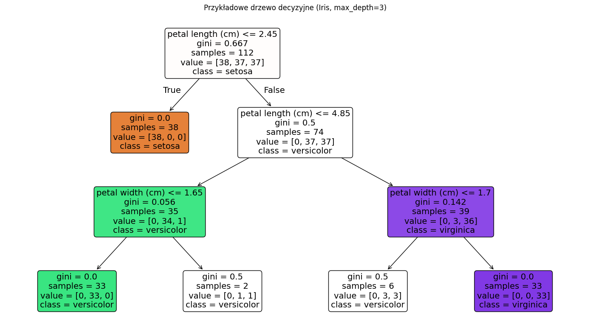

## Podstawowe drzewa decyzyjne

### Klasyczne rodziny algorytmów drzew i ich różnice

W literaturze i praktyce spotyka się kilka „rodzin” algorytmów drzew decyzyjnych. Różnią się one m.in. sposobem doboru podziału (kryterium jakości), dopuszczalną liczbą gałęzi w węźle, obsługą braków danych, strategią przycinania oraz tym, czy wnioski statystyczne są wbudowane w procedurę uczenia.

**ID3 (Iterative Dichotomiser 3)** [@quinlan1986] to jeden z najwcześniejszych, wpływowych algorytmów drzew klasyfikacyjnych. Uczy drzewo *wielogałęziowe* (tzn. węzeł może mieć tyle gałęzi, ile kategorii ma dana cecha) i wybiera podział na podstawie **zysku informacji** (*information gain*), który jest redukcją entropii po podziale. W klasycznej postaci ID3 był projektowany głównie dla cech kategorycznych, nie posiadał pełnego, ustandaryzowanego mechanizmu przycinania i jest wrażliwy na cechy o dużej liczbie kategorii (mogą sztucznie „wygrywać” kryterium entropijne). Z perspektywy ogólnego spojrzenia na drzewa decyzyjne ważne jest to, że ID3 ustanowił wzorzec: *rekurencyjne dzielenie + entropia/zysk informacji*.

**C4.5** [@quinlan1993] jest rozwinięciem ID3 i przez wiele lat był stosowanym standardem. Wprowadza on m.in. (i) obsługę **zmiennych ciągłych** przez poszukiwanie progu i podziały binarne dla cech liczbowych, (ii) modyfikację kryterium jakości podziału w postaci **współczynnika zysku informacji** (*gain ratio*), który koryguje preferencję dla cech o wielu kategoriach, (iii) obsługę **braków danych** przez rozdzielanie obserwacji z brakami „miękko” (z wagami) między gałęzie lub przez dopasowane heurystyki, oraz (iv) przycinanie oparte o oszacowania błędu (tzw. *error-based pruning*). W praktyce C4.5 produkuje drzewa, które są zwykle mniejsze i bardziej uogólniające niż ID3.

**C5.0** to następca C4.5 [@kuhn2018], zaprojektowany jako szybszy i bardziej skalowalny, z licznymi usprawnieniami inżynieryjnymi i heurystycznymi. Typowo oferuje lepszą wydajność obliczeniową, mniejsze zużycie pamięci oraz dodatkowe możliwości praktyczne (np. kosztowną klasyfikację, mechanizmy „wzmocnienia” w stylu *boosting/committee* w niektórych implementacjach). Koncepcyjnie nadal jest to drzewo „w duchu Quinlana”: kryteria entropijne, sprawna obsługa cech ciągłych i braków oraz silny nacisk na praktyczne uogólnianie.

**CART (Classification and Regression Trees)** [@breiman2017] ujednolica podejście do **klasyfikacji i regresji** w ramach jednego formalizmu. Charakterystyczne cechy CART są następujące: (i) podziały są zazwyczaj **binarne** (nawet dla cech kategorycznych – kategorie dzieli się na dwie grupy), (ii) w klasyfikacji stosuje się zwykle **indeks Giniego** (lub entropię), a w regresji kryterium oparte o **SSE/wariancję**, (iii) kluczowym elementem jest **przycinanie złożoności** (*cost-complexity pruning*), tj. wybór drzewa przez kompromis między dopasowaniem i złożonością, oraz (iv) mechanizm **reguł zastępczych (*surrogate splits*)** jako systematyczna odpowiedź na braki danych. CART jest dziś szczególnie ważne, bo stanowi bazę dla wielu metod zespołowych (*random forest, gradient boosting*) i jest najczęściej spotykaną „architekturą” drzew w ML.

**Conditional inference trees (*conditional trees, ctree*)** [@hothorn2006] powstały jako odpowiedź na znane uprzedzenia klasycznych kryteriów podziału (Gini/entropia/SSE), które mogą faworyzować cechy o wielu możliwych podziałach (np. zmienne ciągłe lub kategoryczne o wielu poziomach). W ctree wybór podziału ma charakter **statystyczny** i opiera się na **testach permutacyjnych niezależności**. Procedura jest dwuetapowa: najpierw w danym węźle testuje się hipotezę globalną, że zmienna docelowa jest niezależna od wszystkich cech (jeśli brak podstaw do jej odrzucenia, węzeł staje się liściem), a następnie – w razie istotności – wykonuje się testy cząstkowe dla każdej cechy i wybiera tę o najsilniejszej zależności z odpowiednią korektą na wielokrotne porównania. Dokładna postać statystyki testowej zależy od typu zmiennej docelowej i predyktora, ale kluczowa idea pozostaje ta sama: podział jest wybierany na podstawie istotności zależności, a nie wyłącznie heurystycznej redukcji nieczystości. Dzięki temu *conditional trees* redukują tendencyjność selekcji zmiennych, a kryterium stopu jest naturalnie powiązane z istotnością statystyczną, a nie wyłącznie z heurystycznymi parametrami złożoności.

**CHAID (Chi-squared Automatic Interaction Detection)** [@kass1980] to klasyczna metoda drzew wielogałęziowych, szczególnie popularna w analizie marketingowej i badaniach społecznych. Jej znakiem rozpoznawczym są: (i) podziały wybierane na podstawie **testów chi-kwadrat** (dla klasyfikacji) lub testów analogicznych dla zmiennych ciągłych, (ii) możliwość **łączenia kategorii** cech kategorycznych w większe grupy przed wykonaniem podziału, oraz (iii) częste stosowanie podziałów **wielogałęziowych** (niekoniecznie binarnych). CHAID jest ceniony za interpretowalność i naturalne traktowanie interakcji w kategoriach, ale w porównaniu do CART bywa mniej „ML-owy” w sensie typowych współczesnych pipeline’ów i częściej występuje w narzędziach statystycznych/BI.

### Rodzaje drzew i podstawowe elementy konstrukcji

W praktyce wyróżnia się przede wszystkim:

-   **drzewa klasyfikacyjne** – gdy zmienna docelowa jest dyskretna (klasy),
-   **drzewa regresyjne** – gdy zmienna docelowa jest ciągła,
-   **drzewa wieloklasowe** – naturalne rozszerzenie klasyfikacji binarnej,
-   **drzewa binarne vs wielogałęziowe** – CART stosuje zwykle podziały binarne, natomiast w niektórych wariantach dopuszcza się podziały na wiele gałęzi (częściej dla cech kategorycznych).

Drzewo składa się z:

-   **korzenia (*root*)** – węzła startowego zawierającego cały zbiór uczący,
-   **węzłów wewnętrznych (*internal nodes*)** – zawierają regułę podziału (cecha + warunek),
-   **gałęzi (*branches*)** – odpowiadają wynikom reguły (np. „tak/nie” dla podziału binarnego),
-   **liści (*leaves/terminal nodes*)** – węzłów końcowych przechowujących predykcję (klasę lub wartość),
-   (opcjonalnie) **wag lub rozkładów w liściu** – np. częstości klas albo inne informacje pomocnicze używane do predykcji.



### Reguły podziału: klasyfikacja i regresja

Węzeł drzewa ma za zadanie wybrać taki podział, który „poprawia jednorodność” powstałych grup. Formalnie dla węzła zawierającego zbiór obserwacji $S$ rozważamy kandydatów podziału $s$ (cecha $j$ i próg $t$, ewentualnie podział kategorii). Podział rozdziela $S$ na $S_L$ i $S_R$. Wybieramy $s$, który maksymalizuje spadek nieczystości (*impurity decrease*):

$$
\Delta I(s) = I(S) - \frac{|S_L|}{|S|} I(S_L) - \frac{|S_R|}{|S|} I(S_R).
$$

**Drzewa klasyfikacyjne.** Nieczystość $I(S)$ definiuje się najczęściej jako:

-   **indeks Giniego**: $$
    I_G(S) = 1 - \sum_{k=1}^K p_k^2,
    $$
-   **entropię (Shannon)**: $$
    I_H(S) = -\sum_{k=1}^K p_k \log p_k,
    $$

gdzie $p_k$ to odsetek obserwacji klasy $k$ w węźle. Intuicyjnie, im bardziej rozkład klas jest skoncentrowany w jednej klasie, tym mniejsza nieczystość. Podział jest „dobry”, jeśli znacząco zwiększa jednorodność klas w dzieciach.

**Drzewa regresyjne.** W regresji nieczystość mierzy się rozproszeniem wartości $y$ w węźle. Najczęściej stosuje się wariancję lub równoważnie sumę kwadratów odchyleń od średniej (SSE):

$$
I_{\text{SSE}}(S) = \sum_{i\in S} (y_i - \bar{y}_S)^2.
$$

Podział wybieramy tak, aby minimalizować łączną SSE po podziale (czyli maksymalizować jej redukcję). W liściu predykcją jest zwykle $\bar{y}_S$ (średnia w liściu), co jest rozwiązaniem minimalizującym SSE w obrębie liścia.

### Jak szuka się optymalnego podziału

W idealnym (globalnym) ujęciu chcielibyśmy znaleźć takie drzewo, które minimalizuje błąd predykcji przy zadanej „złożoności” (np. liczbie liści). Taki problem jest jednak obliczeniowo bardzo trudny: liczba możliwych drzew rośnie wykładniczo wraz z liczbą obserwacji i cech, a wybór optymalnej struktury wymagałby przeszukania ogromnej przestrzeni kombinatorycznej. Dlatego praktyczne algorytmy drzew (CART, C4.5, CHAID, ctree) stosują podejście **zachłanne** (*greedy, top–down recursive partitioning*): w każdym węźle wybierają najlepszy lokalnie podział według zadanego kryterium i dopiero potem powtarzają procedurę w węzłach potomnych.

W podejściu zachłannym konstrukcja drzewa ma postać iteracji:

1.  W węźle z danymi $S$ rozważamy zbiór kandydatów podziału $s$ (cecha $j$ i warunek podziału).
2.  Dla każdego kandydata obliczamy spadek nieczystości $\Delta I(s)$ (dla klasyfikacji: Gini/entropia; dla regresji: SSE/wariancja).
3.  Wybieramy $s^* = \arg\max_s \Delta I(s)$, wykonujemy podział $S \to (S_L,S_R)$.
4.  Rekurencyjnie powtarzamy kroki 1–3 w węzłach potomnych, dopóki nie zajdzie warunek stopu.

#### Cechy ciągłe: jak wyznacza się kandydatów progów

Dla cechy ciągłej $x_j$ naturalną regułą podziału jest próg $t$: $x_j \le t$ vs $x_j > t$. Kandydatami progów nie są wszystkie liczby rzeczywiste, lecz wartości „pomiędzy” obserwacjami. W praktyce postępuje się tak:

-   sortuje się obserwacje według $x_j$,
-   rozważa się progi będące środkami między kolejnymi *różnymi* wartościami $x_j$, tj. $t = (v_{(m)} + v_{(m+1)})/2$,
-   często pomija się progi, które nie zmieniają przypisań (np. wiele powtórzeń wartości) lub które łamią ograniczenia typu `min_samples_leaf`.

Dzięki temu liczba kandydatów dla jednej cechy jest rzędu $O(n)$, a nie nieskończona. W implementacjach produkcyjnych dodatkowo używa się trików obliczeniowych: po posortowaniu można aktualizować liczności klas (lub sumy/kwadraty sum w regresji) „przesuwając” próg krok po kroku, bez przeliczania wszystkiego od zera, co istotnie przyspiesza selekcję najlepszego $t$.

#### Cechy kategoryczne: podziały binarne i wielogałęziowe

Dla cech kategorycznych istnieją dwie główne szkoły:

-   **podziały wielogałęziowe** (np. w ID3/C4.5/CHAID): węzeł może mieć osobną gałąź dla każdej kategorii; to bywa bardzo interpretowalne, ale może prowadzić do „fragmentacji” danych (małe liczności w gałęziach),
-   **podziały binarne** (CART): kategorie dzieli się na dwie grupy $A$ i $\bar A$, tzn. $x_j \in A$ vs $x_j \notin A$.

Podziały binarne dla cechy o $m$ kategoriach mają w najgorszym razie $2^{m-1}-1$ możliwych podziałów, co szybko staje się niepraktyczne. Dlatego stosuje się heurystyki i uproszczenia. Przykładowo:

-   w regresji porządkuje się kategorie według średniej $\bar y$ i rozważa rozcięcia jak dla zmiennej uporządkowanej,
-   w klasyfikacji można porządkować kategorie według $\hat p(y=1\mid x_j)$ (dla binarnej klasy) lub stosować przybliżone przeszukiwanie,
-   przy dużej liczbie poziomów stosuje się łączenie rzadkich kategorii do `other` lub narzuca minimalne liczności.

#### Braki danych a wybór podziału

W zależności od algorytmu i implementacji, braki mogą być obsługiwane na kilka sposobów: przez wcześniejszą imputację, przez traktowanie „braku” jako osobnej kategorii (częste w praktyce), przez wybór domyślnego kierunku podziału (np. brak $\to$ lewa gałąź) lub przez mechanizmy takie jak *surrogate splits* w CART [^04-drzewa-zespoly-1].

[^04-drzewa-zespoly-1]: Reguły zastępcze to mechanizm kojarzony przede wszystkim z CART, używany gdy dla obserwacji brakuje wartości cechy, według której w danym węźle wykonywany jest podział. Zamiast odrzucać obserwację lub imputować brak, drzewo może wybrać **alternatywną regułę podziału** opartą o inną cechę, która możliwie najlepiej „naśladuje” podział główny. W praktyce buduje się ranking reguł zastępczych na podstawie zgodności przypisań do gałęzi (np. jak często podział zastępczy wysyła obserwacje do tej samej strony co podział główny w danych treningowych). Dzięki temu drzewo zachowuje spójność działania nawet przy brakach danych.

#### Kontrola złożoności: pre-pruning i (w CART) post-pruning

Ponieważ strategia zachłanna łatwo prowadzi do bardzo głębokich drzew, w praktyce kontroluje się złożoność na dwa sposoby:

-   **pre-pruning** (ograniczenia w trakcie budowy) - zamiast budować bardzo głębokie drzewo, można narzucić ograniczenia już na etapie wzrostu, aby zmniejszyć wariancję i ryzyko przeuczenia.

    -   `max_depth` – maksymalna głębokość drzewa (liczba krawędzi/poziomów od korzenia do liścia). Małe wartości ograniczają liczbę kolejnych podziałów, co zwykle zwiększa bias, ale zmniejsza wariancję.
    -   `min_samples_split` – minimalna liczba obserwacji w węźle, aby w ogóle rozważać jego podział. Jeśli węzeł ma mniej obserwacji, staje się liściem.
    -   `min_samples_leaf` – minimalna liczba obserwacji, która musi pozostać w każdym liściu po podziale. W praktyce eliminuje to podziały tworzące bardzo małe, niestabilne liście (np. podział 3 vs 97 przy `min_samples_leaf=10` jest niedozwolony).
    -   `max_leaf_nodes` – maksymalna liczba liści w całym drzewie. To bezpośrednia kontrola złożoności, bo liczba liści determinuje liczbę regionów decyzyjnych.
    -   `min_impurity_decrease` – minimalna wymagana redukcja nieczystości $\Delta I(s)$, aby zaakceptować podział. Jeśli najlepszy możliwy podział w węźle nie daje spadku nieczystości większego od progu, algorytm przerywa wzrost i tworzy liść.

-   **post-pruning** (przycinanie po zbudowaniu dużego drzewa) – w CART najpierw buduje się drzewo „maksymalne" (silnie dopasowane do danych treningowych), a następnie stopniowo usuwa się jego gałęzie, szukając poddrzewa, które najlepiej równoważy **dopasowanie** i **złożoność**.

    Standardową techniką jest *cost-complexity pruning* (zwane też *weakest-link pruning*). Dla rodziny poddrzew minimalizuje się kryterium:

    $$
    R_\alpha(T) = R(T) + \alpha\,|T|,
    $$

    gdzie:

    -   $R(T)$ – miara straty drzewa $T$ (np. suma SSE w regresji lub ważona suma nieczystości Giniego w klasyfikacji),
    -   $|T|$ – liczba liści (*terminal nodes*), czyli miara złożoności,
    -   $\alpha \ge 0$ – parametr kary za złożoność: im większe $\alpha$, tym bardziej preferowane są drzewa proste.

    **Procedura przycinania (idea „najsłabszego ogniwa")** przebiega następująco:

    1. Dla każdego węzła wewnętrznego $t$ oblicza się, ile zysku (redukcji straty) daje utrzymanie jego poddrzewa $T_t$ w przeliczeniu na każdy dodatkowy liść:
    $$
    g(t) = \frac{R(t) - R(T_t)}{|T_t| - 1},
    $$
    gdzie $R(t)$ to strata po zastąpieniu $T_t$ jednym liściem, a $R(T_t)$ to strata pełnego poddrzewa.
    2. Węzeł o najniższym $g(t)$ to „najsłabsze ogniwo" – jego poddrzewo wnosi najmniej w stosunku do swojego kosztu, więc zostaje usunięte (zastąpione liściem).
    3. Krok powtarza się, co daje **skończoną sekwencję zagnieżdżonych poddrzew**:
    $$
    T_0 \supset T_1 \supset \cdots \supset T_M,
    $$
    odpowiadających rosnącym wartościom $\alpha$.

    Dzięki temu zamiast przeszukiwać wszystkie możliwe poddrzewa, porównujemy tylko $M+1$ kandydatów.

    **Dobór $\alpha$** (czyli wybór końcowego drzewa) odbywa się zwykle przez walidację krzyżową: dla każdego kandydata $T_m$ estymuje się błąd generalizacji i wybiera drzewo o najniższym błędzie. Popularną praktyką jest **reguła 1-SE** – wybiera się najprostsze drzewo, którego błąd walidacyjny mieści się w granicach jednego odchylenia standardowego od minimum.

### Reguły stopu (*stopping rules*)

Wzrost drzewa (rekurencyjne dzielenie) nie może trwać w nieskończoność. W pewnym momencie węzeł powinien zostać liściem. Z punktu widzenia konstrukcji algorytmu reguły stopu można podzielić na dwie grupy:

1.  **Reguły „merytoryczne” (lokalne)** - mówią, że dalszy podział nie ma sensu, bo nie poprawia jakości lub nie da się go wykonać (np. wszystkie obserwacje należą do jednej klasy).
2.  **Reguły „regularizacyjne” (kontrola złożoności)** - narzucają ograniczenia, aby ograniczyć przeuczenie (np. limit głębokości, minimalna liczność liścia).

#### Typowe reguły stopu

Poniżej najczęściej spotykane kryteria, które zatrzymują wzrost drzewa w danym węźle:

-   **Czystość węzła (purity).**

    -   klasyfikacja: jeśli węzeł jest jednorodny, tzn. $p_k=1$ dla pewnej klasy $k$, to $I(S)=0$ i dalszy podział nie ma sensu,
    -   regresja: analogicznie, jeśli wszystkie $y_i$ w węźle są identyczne (wariancja = 0), podział nie poprawi SSE.

-   **Brak dopuszczalnego podziału.** Dla każdej cechy może się okazać, że nie istnieje próg/kombinacja kategorii, która tworzy dwie niepuste gałęzie i spełnia ograniczenia liczności.

-   **Minimalna poprawa jakości (próg na** $\Delta I$). Jeżeli najlepszy możliwy podział w węźle daje redukcję nieczystości mniejszą niż ustalony próg, to przerywamy wzrost:

    $$
    \max_s \Delta I(s) < \tau \quad \Rightarrow \quad \text{węzeł staje się liściem.}
    $$

-   **Minimalna liczność węzła i liścia.**

    -   aby rozważać podział: $|S| \ge n_{\text{split}}$,
    -   aby zaakceptować podział: $|S_L|,|S_R| \ge n_{\text{leaf}}$.

-   **Ograniczenie głębokości lub liczby liści.** W praktyce kontroluje liczbę regionów decyzyjnych i stabilność modelu.

W drzewach typu *ctree* (*conditional inference*) reguła stopu może wynikać wprost z testowania: jeśli brak istotnej zależności (po korekcji na wielokrotne porównania), węzeł staje się liściem. W klasycznym CART reguły stopu mają zwykle charakter heurystyczny/regularizacyjny (parametry złożoności), a dodatkową kontrolę zapewnia post-pruning.

### Predykcja z drzewa

Predykcja polega na „przejściu” obserwacji przez drzewo od korzenia do liścia, wykonując po drodze kolejne testy.

-   **Drzewo klasyfikacyjne:** w liściu przechowuje się rozkład klas (częstości) $\hat{p}_k$. Predykcją klasy jest zwykle $\arg\max_k \hat{p}_k$, a predykcją probabilistyczną – wektor $(\hat{p}_1,\dots,\hat{p}_K)$.
-   **Drzewo regresyjne:** w liściu przechowuje się wartość liczbową, najczęściej średnią $\bar{y}_S$ (lub medianę, zależnie od kryterium). Predykcja to ta wartość przypisana do liścia, do którego trafia obserwacja.

::: {#exm-1}
## Przykład: drzewo klasyfikacyjne dla gatunku muzycznego (Spotify)

Poniżej budujemy proste drzewo klasyfikacyjne przewidujące **gatunek muzyczny** na podstawie numerycznych cech akustycznych utworów (np. *danceability, energy, loudness, tempo*). Jest to typowy przypadek danych tablicowych, gdzie drzewa decyzyjne są dobrym modelem bazowym.

W tym przykładzie **nie wykonujemy klasycznego preprocessingu typu standaryzacja/normalizacja**. Wynika to z faktu, że reguły w drzewach mają postać progów porównujących wartości cech (np. $x_j \le t$), więc skala zmiennych nie wpływa na sens podziału w taki sposób jak w metodach opartych o iloczyny skalarne (np. regresja logistyczna, SVM). Innymi słowy: drzewo nie korzysta z odległości euklidesowej ani z norm współczynników, tylko z porównań i wyboru progów, dlatego **skalowanie cech nie jest wymagane**. W praktyce pozostają jedynie „minimalne” kroki porządkowe: wybór cech liczbowych i ewentualne uzupełnienie braków (jeśli występują).

Uwaga dydaktyczna: zbiór Spotify zawiera wiele klas (gatunków). Aby uzyskać czytelny przykład (i sensowną macierz pomyłek), ograniczamy się do $K=10$ najczęstszych gatunków.

```{python}
import pandas as pd
import matplotlib.pyplot as plt

from datasets import load_dataset
from sklearn.impute import SimpleImputer
from sklearn.model_selection import train_test_split
from sklearn.tree import DecisionTreeClassifier, plot_tree
from sklearn.metrics import (
    accuracy_score,
    balanced_accuracy_score,
    f1_score,
    classification_report,
    confusion_matrix,
    ConfusionMatrixDisplay,
 )

# 1) Wczytanie danych (Hugging Face Datasets)
ds = load_dataset("maharshipandya/spotify-tracks-dataset", split="train")
df = ds.to_pandas()

# 2) Kolumna docelowa
target = "track_genre"
if target not in df.columns:
    raise ValueError(
        f"Nie znaleziono kolumny docelowej '{target}'. Dostępne kolumny: "
        + ", ".join(df.columns)
    )

# 3) Ograniczamy się do 10 najczęstszych gatunków
top_k = 10
top_genres = df[target].value_counts().head(top_k).index
df = df[df[target].isin(top_genres)].copy()
df = df.dropna(subset=[target]).copy()

# 4) Usuwamy zmienne, które nie niosą sensownej informacji predykcyjnej
drop_cols = ["Unnamed: 0", "track_id", "album_name", "track_name", "artists"]
df = df.drop(columns=[c for c in drop_cols if c in df.columns]).copy()

# 5) Braki danych (po filtracji i czyszczeniu)
missing_by_col = df.isna().sum()
missing_total = int(missing_by_col.sum())
print(f"Braki danych (łącznie): {missing_total}")
```

```{python}
# 6) Cechy: bierzemy tylko numeryczne (+ bool jako 0/1), bo DecisionTreeClassifier nie przyjmuje stringów
X = df.select_dtypes(include=["number", "bool", "boolean"]).drop(columns=[target], errors="ignore").copy()
for col in X.columns:
    if str(X[col].dtype) in ("bool", "boolean"):
        X[col] = X[col].astype("int8")

y = df[target].astype(str)

# 7) Podział na train/test (stratyfikacja utrzymuje proporcje klas)
X_train, X_test, y_train, y_test = train_test_split(
    X, y, test_size=0.2, random_state=44, stratify=y
)

# 7b) Minimalna imputacja braków - potrzebna, bo klasyczne drzewa w scikit-learn
# nie obsługują NaN bezpośrednio.
imputer = SimpleImputer(strategy="median")
X_train = pd.DataFrame(imputer.fit_transform(X_train), columns=X.columns, index=X_train.index)
X_test = pd.DataFrame(imputer.transform(X_test), columns=X.columns, index=X_test.index)

# 8) Model: samo drzewo (bez pipeline/preprocessingu)
tree = DecisionTreeClassifier(
    random_state=44,
    max_depth=8,
    min_samples_leaf=10,
 )
tree.fit(X_train, y_train)

# 9) Pełne drzewo tekstowo (cała struktura)
feature_names = list(X.columns)
# nie wyświetlamy całej struktury, bo dla tego zbioru jest mało czytelna
```

```{python}
# 10) Predykcja i metryki
y_pred = tree.predict(X_test)

acc = accuracy_score(y_test, y_pred)
bacc = balanced_accuracy_score(y_test, y_pred)
f1m = f1_score(y_test, y_pred, average="macro")

print("Metryki (test):")
print(f"  Accuracy          : {acc:.4f}")
print(f"  Balanced accuracy : {bacc:.4f}")
print(f"  F1 macro          : {f1m:.4f}\n")

print("Classification report (macro/weighted):")
print(classification_report(y_test, y_pred))

# 11) Macierz pomyłek
labels = tree.classes_
cm = confusion_matrix(y_test, y_pred, labels=labels)

fig, ax = plt.subplots(figsize=(10, 8))
disp = ConfusionMatrixDisplay(confusion_matrix=cm, display_labels=labels)
disp.plot(ax=ax, xticks_rotation=45, values_format="d", colorbar=False)
ax.set_title("Drzewo decyzyjne: macierz pomyłek (test)")
fig.tight_layout()
plt.show()
```

```{python}
# 12) Wizualizacja drzewa (okrojona)
fig, ax = plt.subplots(figsize=(14, 10))
plot_tree(
    tree,
    feature_names=feature_names,
    class_names=list(labels),
    filled=True,
    rounded=True,
    max_depth=3,
    fontsize=9,
    ax=ax,
 )
ax.set_title("Drzewo klasyfikacyjne (podgląd pierwszych trzech poziomów)")
fig.tight_layout()
plt.show()
```

Spróbujemy teraz przyciąć drzewo w celu poprawy jego zdolności generalizacyjnych.

```{python}
import numpy as np
from sklearn.model_selection import StratifiedKFold, cross_val_score

# Post-pruning (CART): cost-complexity pruning sterowane parametrem ccp_alpha.
# Dla rosnących wartości ccp_alpha dostajemy coraz mniejsze poddrzewa.

# 1) Ścieżka przycinania (kandydaci na alpha)
path = tree.cost_complexity_pruning_path(X_train, y_train)
ccp_alphas = path.ccp_alphas

# Zwykle ostatnia wartość alpha daje drzewo 1-węzłowe (sam korzeń), więc ją pomijamy.
ccp_alphas = ccp_alphas[:-1]

print(f"Liczba kandydatów ccp_alpha: {len(ccp_alphas)}")
print(f"Zakres ccp_alpha: [{ccp_alphas.min():.6g}, {ccp_alphas.max():.6g}]")

# 2) Dobór ccp_alpha przez CV na zbiorze treningowym
cv = StratifiedKFold(n_splits=5, shuffle=True, random_state=42)
mean_scores = []

base_params = tree.get_params()
for a in ccp_alphas:
    t = DecisionTreeClassifier(
        random_state=base_params["random_state"],
        max_depth=base_params["max_depth"],
        min_samples_leaf=base_params["min_samples_leaf"],
        ccp_alpha=float(a),
    )
    scores = cross_val_score(t, X_train, y_train, cv=cv, scoring="balanced_accuracy")
    mean_scores.append(scores.mean())

mean_scores = np.array(mean_scores)
best_idx = int(mean_scores.argmax())
best_alpha = float(ccp_alphas[best_idx])

print(f"Najlepsze ccp_alpha (CV): {best_alpha:.6g}")
print(f"Najlepszy balanced_accuracy (CV): {mean_scores[best_idx]:.4f}")

# (opcjonalnie) wykres: alpha vs wynik CV
plt.figure(figsize=(8, 4))
plt.plot(ccp_alphas, mean_scores, marker="o", linewidth=1)
plt.axvline(best_alpha, linestyle="--")
plt.xlabel("ccp_alpha")
plt.ylabel("CV balanced_accuracy")
plt.title("Dobór ccp_alpha (cost-complexity pruning)")
plt.tight_layout()
plt.show()

# 3) Uczenie drzewa przyciętego najlepszym alpha i porównanie z bazowym
tree_pruned = DecisionTreeClassifier(
    random_state=base_params["random_state"],
    max_depth=base_params["max_depth"],
    min_samples_leaf=base_params["min_samples_leaf"],
    ccp_alpha=best_alpha,
)
tree_pruned.fit(X_train, y_train)

def describe_tree(model, name: str) -> None:
    print(
        f"{name}: node_count={model.tree_.node_count}, leaves={model.get_n_leaves()}, depth={model.get_depth()}"
    )

describe_tree(tree, "Drzewo bazowe")
describe_tree(tree_pruned, "Drzewo przycięte")

y_pred_pruned = tree_pruned.predict(X_test)
print("\nMetryki (test) po przycinaniu:")
print(f"  Accuracy          : {accuracy_score(y_test, y_pred_pruned):.4f}")
print(f"  Balanced accuracy : {balanced_accuracy_score(y_test, y_pred_pruned):.4f}")
print(f"  F1 macro          : {f1_score(y_test, y_pred_pruned, average='macro'):.4f}")
```

Przycinanie drzewa nie poprawiło znacząco jakości klasyfikacji, ale model został uproszczony. Tego typu uproszczenie zwykle oznacza wzrost biasu i spadek wariancji; w tym uruchomieniu zysk jakościowy na teście jest niewielki, ale liczba węzłów i liści maleje, co poprawia prostotę i interpretowalność modelu.
:::

## Bagging i lasy losowe

Bagging (*bootstrap aggregating*) i lasy losowe (*random forests*) należą do metod **zespołowych** (*ensemble methods*), w których wiele słabych/średnich modeli (zwykle drzew) łączy się w jeden silniejszy predyktor. Kluczowa intuicja jest taka, że pojedyncze drzewo decyzyjne ma zwykle **niskie obciążenie (bias)**, ale **wysoką wariancję** – niewielka zmiana danych uczących może prowadzić do zauważalnie innej struktury drzewa i innych predykcji. Bagging i random forest redukują wariancję przez **uśrednianie (agregację) wielu „odmian” tego samego algorytmu**, uczonych na lekko zmodyfikowanych próbkach.

### Od bootstrapu do lasów losowych

Rozwój tych metod można zrozumieć jako sekwencję pomysłów, które stopniowo zwiększały stabilność modeli i jakość uogólniania:

-   **Bootstrap** [@efron1979]- technika resamplingu „z powtórzeniami” do przybliżania rozkładów estymatorów i błędu. To właśnie bootstrap dał naturalny mechanizm generowania wielu „wersji” zbioru treningowego.
-   **Bagging** [@breiman1996]- pomysł, aby trenować ten sam algorytm na wielu próbkach bootstrapowych i agregować wyniki. Breiman pokazał, że bagging szczególnie dobrze stabilizuje metody niestabilne (jak drzewa).
-   **Random subspace / losowanie cech** [@tinkamho1998]- idea, aby dodatkowo losować podzbiór cech, na których uczony jest model. To zmniejsza korelację między modelami w zespole.
-   **Random Forest** [@breiman2001]- połączenie baggingu drzew z losowaniem cech *w każdym węźle* drzewa (a nie tylko raz na drzewo). To okazało się bardzo skutecznym i prostym „domyślnym” modelem dla danych tablicowych.
-   **Extremely Randomized Trees** [@geurts2006] - dalsza randomizacja poprzez losowanie progów podziału, co jeszcze bardziej dekoreluje drzewa, czasem poprawiając wynik kosztem większego bias.

### Koncepcja baggingu

Niech $\mathcal{D} = \{(x_i, y_i)\}_{i=1}^n$ oznacza zbiór uczący, a $\hat f(\cdot;\mathcal{D})$ – model (np. drzewo) wyuczony na danych $\mathcal{D}$. W baggingu generujemy $B$ próbek bootstrapowych $\mathcal{D}^{(1)},\dots,\mathcal{D}^{(B)}$, gdzie każda $\mathcal{D}^{(b)}$ ma rozmiar $n$ i powstaje przez losowanie obserwacji z $\mathcal{D}$ *z powtórzeniami*.

-   **Bagging w regresji (uśrednianie):**

    $$
    \hat f_{\text{bag}}(x) = \frac{1}{B}\sum_{b=1}^B \hat f^{(b)}(x),
    $$

    gdzie $\hat f^{(b)}(x) = \hat f(x;\mathcal{D}^{(b)})$.

-   **Bagging w klasyfikacji (głosowanie większościowe):**

    $$
    \hat y_{\text{bag}}(x) = \arg\max_{k\in\{1,\dots,K\}} \sum_{b=1}^B \mathbb{1}\{\hat y^{(b)}(x)=k\}.
    $$

    W wersji probabilistycznej często uśrednia się estymowane prawdopodobieństwa klas.

**Dlaczego to działa?** Jeśli pojedynczy model ma wariancję $\mathrm{Var}(\hat f(x))$, to uśrednienie $B$ modeli obniża wariancję. W idealnym przypadku niezależności modeli:

$$
\mathrm{Var}\big(\hat f_{\text{bag}}(x)\big) = \frac{1}{B}\,\mathrm{Var}(\hat f(x)).
$$

W praktyce modele nie są niezależne; jeśli ich korelacja w punkcie $x$ wynosi $\rho$, to w przybliżeniu:

$$
\mathrm{Var}\big(\hat f_{\text{bag}}(x)\big) \approx \rho\,\mathrm{Var}(\hat f(x)) + \frac{1-\rho}{B}\,\mathrm{Var}(\hat f(x)).
$$

Zatem kluczowe są dwa elementy: **(i) duża liczba drzew** $B$ oraz **(ii) mała korelacja** $\rho$ między drzewami. Bagging zwiększa różnorodność przez bootstrap, a *random forest* dodatkowo obniża korelację przez losowanie cech.

### Lasy losowe

Random forest jest specjalnym przypadkiem baggingu, gdzie modelem bazowym jest drzewo decyzyjne, ale w każdym węźle drzewa **nie rozważa się wszystkich** $p$ cech, tylko losowy podzbiór $m$ cech (często oznaczany jako *mtry*). Następnie wybiera się najlepszy podział **tylko wśród tych** $m$ cech. Dzięki temu różne drzewa stają się mniej do siebie podobne (mniejsza korelacja), a zespół lepiej redukuje wariancję.

#### Algorytm budowy lasu losowego

Dla $b=1,\dots,B$:

1.  Wylosuj próbkę bootstrapową $\mathcal{D}^{(b)}$.
2.  Ucz drzewo $T^{(b)}$ rekurencyjnie:
    -   w każdym węźle losuj bez zwracania $m$ cech spośród $p$,
    -   wyznacz najlepszy podział (maksymalna redukcja nieczystości) tylko wśród tych $m$ cech,
    -   kontynuuj aż do kryterium stopu (często drzewo rośnie „głęboko”, np. do minimalnej liczności liścia).

Predykcja:

-   regresja: $\hat f_{\text{RF}}(x)=\frac{1}{B}\sum_{b=1}^B T^{(b)}(x)$,
-   klasyfikacja: głosowanie większościowe (lub uśrednianie $\hat p_k(x)$).

### Najważniejsze parametry i ich interpretacja

Poniżej zebrano parametry typowe dla implementacji w stylu `scikit-learn` (nazwy mogą się różnić w innych bibliotekach, ale sens jest ten sam).

#### Parametry wspólne (bagging drzew i random forest)

-   `n_estimators` ($B$) – liczba drzew. Zwiększanie $B$ zwykle poprawia stabilność i jakość (wariancja maleje), ale z malejącymi przyrostami. W praktyce dobiera się $B$ tak, aby wynik się „stabilizował”.
-   `bootstrap` / `max_samples` – sposób i rozmiar próbkowania. Klasycznie losuje się $n$ obserwacji z powtórzeniami; `max_samples` pozwala użyć ułamka danych (czasem przyspiesza, czasem zwiększa różnorodność).
-   Parametry drzewa bazowego (kontrola złożoności) - `max_depth`, `min_samples_leaf`, `min_samples_split`, `max_leaf_nodes`, `min_impurity_decrease`. W zespołach często pozwala się drzewom rosnąć głęboko (niski *bias*), a wariancję kontroluje się przez agregację.

#### Parametry specyficzne dla random forest

-   `max_features` ($m$, *mtry*) – liczba losowanych cech w węźle. To parametr krytyczny dla korelacji między drzewami.

    -   Jeśli $m=p$, random forest redukuje się do klasycznego baggingu drzew (drzewa są bardziej podobne).
    -   Jeśli $m$ jest małe, drzewa są bardziej zróżnicowane (mniejsza korelacja), ale pojedyncze drzewo jest słabsze (większy bias).

    Popularne heurystyki startowe: w klasyfikacji $m\approx\sqrt{p}$, w regresji $m\approx p/3$ (to są reguły kciuka, a nie prawa).

-   `oob_score` – ocena *out-of-bag* (OOB). W bootstrapie ok. $1-1/e\approx 63.2\%$ obserwacji trafia do danej próbki, a pozostałe $~36.8\%$ są „poza próbką” dla tego drzewa (*out-of-bag*). Można więc estymować błąd generalizacji bez osobnego zbioru walidacyjnego: dla każdej obserwacji agreguje się predykcje tylko z drzew, które jej nie widziały.

-   **Ważność cech (feature importance).** Najczęściej spotykamy dwa podejścia:

    1.  **MDI (*mean decrease in impurity*)** – uśredniona redukcja nieczystości przypisana do danej cechy po wszystkich węzłach i drzewach.
    2.  ***Permutation importance*** – mierzy spadek jakości (np. accuracy/AUC) po losowym przemieszaniu wartości danej cechy; to podejście jest zwykle bardziej wiarygodne, bo mierzy wpływ na predykcję, ale jest droższe obliczeniowo.

    Uwaga praktyczna: MDI może faworyzować cechy ciągłe lub o wielu poziomach; *permutation importance* jest na to mniej wrażliwa, choć wciąż może cierpieć przy silnie skorelowanych cechach.

### Bagging vs random forest

-   **Wspólne** - oba podejścia uczą wiele drzew na próbkach bootstrapowych i agregują ich predykcje. Głównym celem jest redukcja wariancji.
-   **Różnica kluczowa** - random forest wprowadza dodatkową losowość przez `max_features` w każdym węźle, co **obniża korelację między drzewami** i zwykle poprawia wynik względem czystego baggingu drzew.
-   **Kiedy bagging wystarcza** - gdy liczba cech jest mała i drzewa i tak są zróżnicowane, zysk z losowania cech może być niewielki.
-   **Kiedy RF jest lepszy** - gdy jest wiele cech i/lub część cech dominuje (silnie predykcyjnych) – losowanie cech zapobiega sytuacji, w której wszystkie drzewa w kółko wybierają te same pierwsze podziały.

### Własności drzew i modeli typu *ensemble*

-   **Brak potrzeby skalowania** - drzewom i ich zespołom zwykle nie przeszkadzają różne skale cech (dzielą według progów), więc standaryzacja zazwyczaj nie jest wymagana.
-   **Odporność na nieliniowości i interakcje** - RF i bagging drzew automatycznie modelują interakcje i nieliniowości, co czyni je mocnym baseline’em.
-   **Interpretowalność** - pojedyncze drzewo jest czytelne, natomiast model bagging lub las losowy jest mniej przejrzysty. W praktyce stosuje się ważności cech, wykresy PDP czy SHAP do interpretacji.
-   **Braki danych i kategorie** - w zależności od implementacji potrzebujemy imputacji lub kodowania kategorii; część nowoczesnych bibliotek (np. `CatBoost`) rozwiązuje to natywnie, ale klasyczny RF często wymaga przygotowania danych.

::: {#exm-2}
Dla tych samych danych co w @exm-1 przeprowadzimy trening modeli bagging i lasu losowego.

```{python}
from sklearn.ensemble import BaggingClassifier, RandomForestClassifier

# Bagging i Random Forest na tych samych danych (X_train/X_test, y_train/y_test)

def make_bagging(estimator):
    # sklearn zmieniał nazwę parametru z base_estimator -> estimator
    try:
        return BaggingClassifier(
            estimator=estimator,
            n_estimators=200,
            bootstrap=True,
            n_jobs=-1,
            random_state=44,
        )
    except TypeError:
        return BaggingClassifier(
            base_estimator=estimator,
            n_estimators=200,
            bootstrap=True,
            n_jobs=-1,
            random_state=44,
        )


def eval_model(model, name: str):
    yhat = model.predict(X_test)
    return {
        "model": name,
        "accuracy": accuracy_score(y_test, yhat),
        "balanced_accuracy": balanced_accuracy_score(y_test, yhat),
        "f1_macro": f1_score(y_test, yhat, average="macro"),
    }


# 1) Bagging (drzewo jako estimator bazowy)
base_tree = DecisionTreeClassifier(
    random_state=44,
    max_depth=tree.get_params()["max_depth"],
    min_samples_leaf=tree.get_params()["min_samples_leaf"],
)

bag = make_bagging(base_tree)
bag.fit(X_train, y_train)

# 2) Random Forest
rf = RandomForestClassifier(
    n_estimators=300,
    random_state=44,
    n_jobs=-1,
    max_features="sqrt",
)
rf.fit(X_train, y_train)

# 3) Porównanie z drzewem surowym i przyciętym
results = [
    eval_model(tree, "Drzewo (surowe)"),
    eval_model(tree_pruned, "Drzewo (przycięte)"),
    eval_model(bag, "Bagging"),
    eval_model(rf, "Random Forest"),
]

res_df = pd.DataFrame(results).sort_values("balanced_accuracy", ascending=False)
print(res_df.to_string(index=False, float_format=lambda x: f"{x:.4f}"))
```

W tym uruchomieniu las losowy okazał się najlepszym modelem w tej grupie. Często modele zespołowe przewyższają pojedyncze drzewo, ale nie należy traktować tego jako reguły bez wyjątków: dużo zależy od danych, strojenia i sposobu walidacji.
:::

## Boosting

*Boosting* to druga fundamentalna rodzina metod zespołowych, w której modele buduje się **sekwencyjnie** - każdy kolejny model ma korygować błędy poprzednich. W odróżnieniu od baggingu, który przede wszystkim redukuje wariancję przez uśrednianie wielu podobnych modeli uczonych niezależnie, boosting jest projektowany tak, aby budować coraz lepszy predyktor addytywny, często zmniejszając bias, ale w praktyce wpływając również na wariancję. W praktyce boosting często daje bardzo wysoką jakość na danych tablicowych, ale wymaga ostrożnej kontroli złożoności, bo potrafi łatwiej niż bagging dopasować się nadmiernie do danych.

### Rys historyczny

Rozwój boostingu można przedstawić jako przejście od idei teoretycznej do bardzo wydajnych implementacji:

-   **Idea „wzmacniania” słabych klasyfikatorów** [@schapire1990]- pokazano, że jeśli istnieje algorytm osiągający wynik minimalnie lepszy niż losowy (*weak learner*), to można go „wzmocnić” do klasyfikatora o dowolnie małym błędzie treningowym przez odpowiednią procedurę zespołową.
-   **AdaBoost** [@freund1997]- praktyczny algorytm boostingu, w którym kolejne klasyfikatory uczą się na danych z wagami, skupiając się na obserwacjach trudnych (wcześniej błędnie klasyfikowanych).
-   **Gradient Boosting / Multiple Additive Regression Trees** [@friedman2001]- uogólnienie boostingu do postaci optymalizacji funkcji straty w przestrzeni funkcji, interpretowane jako „zejście gradientowe” w modelu addytywnym.
-   **XGBoost** [@chen2016]- bardzo wydajna implementacja gradientowego boostingu drzew z regularizacją, obsługą braków i szeregiem optymalizacji obliczeniowych (m.in. przyspieszone wyznaczanie podziałów, równoległość, przycinanie przez ograniczenia).
-   **LightGBM** [@ke2017]- to wysoce wydajna i skalowalna implementacja gradientowego boostingu drzew (GBDT), wykorzystująca m.in. histogramowe wyznaczanie podziałów oraz strategię wzrostu *leaf-wise* (*best-first*) w celu przyspieszenia uczenia przy zachowaniu wysokiej jakości predykcji.
-   **CatBoost** [@dorogush2017] - boosting drzew z natywną obsługą zmiennych kategorycznych oraz mechanizmami ograniczającymi *target leakage* i przeuczenie (m.in. uporządkowane statystyki docelowe, *ordered boosting*).

### Koncepcja - model addytywny i uczenie „na błędach”

W większości współczesnych wariantów *boosting* buduje model addytywny postaci:

$$
F_M(x) = \sum_{m=0}^M \nu\, f_m(x),
$$

gdzie $f_m$ to kolejne modele bazowe (często płytkie drzewa), a $\nu\in(0,1]$ to współczynnik uczenia (*learning rate*, *shrinkage*). Sens jest następujący: zamiast uśredniać niezależne modele (jak w baggingu), boosting dokłada kolejne składniki tak, aby minimalizować stratę $\mathcal{L}(y, F(x))$. Małe $\nu$ spowalnia uczenie, ale zwykle poprawia generalizację (wymaga wtedy większej liczby iteracji).

### AdaBoost - boosting przez wagi obserwacji

W klasycznej wersji AdaBoost dla klasyfikacji binarnej $y_i\in\{-1,+1\}$ uczymy sekwencję klasyfikatorów $h_m$. Algorytm utrzymuje rozkład wag $w_i^{(m)}$ na obserwacjach, który w kolejnych iteracjach zwiększa znaczenie przykładów błędnie klasyfikowanych.

1.  Inicjalizacja: $w_i^{(1)}=1/n$.

2.  Dla $m=1,\dots,M$:

    -   ucz $h_m$ na danych z wagami $w^{(m)}$,

    -   oblicz błąd ważony:

        $$
        \varepsilon_m = \frac{\sum_{i=1}^n w_i^{(m)}\,\mathbb{1}\{h_m(x_i)\neq y_i\}}{\sum_{i=1}^n w_i^{(m)}}.
        $$

    -   wyznacz wagę klasyfikatora:

        $$
        \alpha_m = \frac{1}{2}\log\frac{1-\varepsilon_m}{\varepsilon_m}.
        $$

    -   zaktualizuj wagi obserwacji:

        $$
        w_i^{(m+1)} \propto w_i^{(m)}\,\exp\big(-\alpha_m\,y_i\,h_m(x_i)\big),
        $$

        a następnie znormalizuj tak, aby $\sum_i w_i^{(m+1)}=1$.

Końcowy klasyfikator ma postać ważonego głosowania:

$$
H(x)=\mathrm{sign}\Big(\sum_{m=1}^M \alpha_m h_m(x)\Big).
$$

Interpretacyjnie AdaBoost minimalizuje wykładniczą stratę $\sum_i \exp(-y_i F(x_i))$, a $\alpha_m$ rośnie, gdy $h_m$ jest lepszy (ma mniejszy $\varepsilon_m$). W praktyce jako $h_m$ stosuje się często bardzo proste modele, np. *decision stumps* (drzewa głębokości 1), co wzmacnia efekt „uczenia na błędach”.

#### Przykład jednej iteracji AdaBoost

Załóżmy, że mamy $n=5$ obserwacji w klasyfikacji binarnej, gdzie etykiety są kodowane jako $y_i\in\{-1,+1\}$:

| $i$ | $y_i$ | $w_i^{(1)}$ | $h_1(x_i)$ | czy błąd? |
|---:|---:|---:|---:|:---|
| 1 | $+1$ | $0.20$ | $+1$ | nie |
| 2 | $+1$ | $0.20$ | $+1$ | nie |
| 3 | $-1$ | $0.20$ | $+1$ | tak |
| 4 | $-1$ | $0.20$ | $-1$ | nie |
| 5 | $+1$ | $0.20$ | $+1$ | nie |

Na początku wszystkie obserwacje mają takie same wagi, bo:

$$
w_i^{(1)}=\frac{1}{5}=0.20.
$$

Pierwszy słaby klasyfikator $h_1$ pomylił tylko obserwację $i=3$. Błąd ważony wynosi więc:

$$
\varepsilon_1
=
\frac{\sum_{i=1}^5 w_i^{(1)}\mathbb{1}\{h_1(x_i)\neq y_i\}}
{\sum_{i=1}^5 w_i^{(1)}}
=
\frac{0.20}{1}
=0.20.
$$

Waga klasyfikatora w zespole to:

$$
\alpha_1
=
\frac{1}{2}\log\frac{1-\varepsilon_1}{\varepsilon_1}
=
\frac{1}{2}\log\frac{0.80}{0.20}
=
\frac{1}{2}\log 4
\approx 0.693.
$$

Ponieważ $\varepsilon_1<0.5$, klasyfikator jest lepszy niż losowy i dostaje dodatnią wagę. Gdyby $\varepsilon_1$ było bliskie zera, $\alpha_1$ byłoby duże; gdyby $\varepsilon_1=0.5$, wtedy $\alpha_1=0$, czyli klasyfikator nie wnosiłby informacji.
Teraz aktualizujemy wagi obserwacji. Dla poprawnie sklasyfikowanych przykładów mamy $y_i h_1(x_i)=+1$, więc:
$$
w_i^{(2)} \propto w_i^{(1)}\exp(-\alpha_1)
=0.20\cdot \exp(-0.693)
\approx 0.20\cdot 0.50
=0.10.
$$

Dla błędnie sklasyfikowanego przykładu $i=3$ mamy $y_i h_1(x_i)=-1$, więc:

$$
w_3^{(2)} \propto w_3^{(1)}\exp(\alpha_1)
=0.20\cdot \exp(0.693)
\approx 0.20\cdot 2
=0.40.
$$

Wagi nieznormalizowane wynoszą:

| $i$ | czy błąd? | waga nieznormalizowana |
|---:|:---|---:|
| 1 | nie | $0.10$ |
| 2 | nie | $0.10$ |
| 3 | tak | $0.40$ |
| 4 | nie | $0.10$ |
| 5 | nie | $0.10$ |

Suma wag nieznormalizowanych to:

$$
Z_1=0.10+0.10+0.40+0.10+0.10=0.80.
$$

Po normalizacji otrzymujemy wagi na następną iterację:

| $i$ | $w_i^{(2)}$ |
|---:|---:|
| 1 | $0.10/0.80=0.125$ |
| 2 | $0.10/0.80=0.125$ |
| 3 | $0.40/0.80=0.500$ |
| 4 | $0.10/0.80=0.125$ |
| 5 | $0.10/0.80=0.125$ |

Najważniejszy efekt: obserwacja błędnie sklasyfikowana ma teraz wagę $0.50$, czyli w kolejnej iteracji będzie znacznie ważniejsza niż pozostałe. Następny słaby klasyfikator $h_2$ będzie więc uczony tak, aby mocniej uwzględnić właśnie ten trudny przypadek.
Po pierwszej iteracji model addytywny ma postać:

$$
F_1(x)=\alpha_1 h_1(x)\approx 0.693\,h_1(x),
$$

a klasyfikator zespołowy po tej jednej iteracji to:

$$
H_1(x)=\mathrm{sign}(F_1(x)).
$$


### Gradient Boosting - minimalizacja straty w przestrzeni funkcji

Gradient boosting uogólnia ideę „poprawiania błędów” na dowolną funkcję straty $\mathcal{L}$. Model addytywny jest budowany iteracyjnie:

$$
F_m(x) = F_{m-1}(x) + \nu\, f_m(x).
$$

W kroku $m$ dopasowujemy $f_m$ do tzw. **pseudo-reszt** (*pseudo-residuals*), które są ujemnym gradientem straty względem bieżących predykcji:

$$
r_{im} = -\left.\frac{\partial\,\mathcal{L}(y_i, F(x_i))}{\partial F(x_i)}\right|_{F=F_{m-1}}.
$$

Następnie uczymy model bazowy $f_m$ (zwykle płytkie drzewo) tak, aby dobrze aproksymował $r_{im}$ jako funkcję $x_i$. Dla niektórych strat wykonuje się dodatkowo krok „liniowego przeskalowania” (wyszukanie $\gamma_m$):

$$
\gamma_m = \arg\min_{\gamma} \sum_{i=1}^n \mathcal{L}\big(y_i, F_{m-1}(x_i)+\gamma f_m(x_i)\big),
$$

i aktualizuje się $F_m(x)=F_{m-1}(x)+\nu\,\gamma_m f_m(x)$. W wielu implementacjach drzewiastych $\gamma_m$ jest w praktyce „wbudowane” w wartości w liściach.

#### Algorytm (schemat) gradientowego boostingu drzew

1.  Ustal początkowy model $F_0(x)$ (np. stałą minimalizującą stratę: średnią dla MSE, logit rozkładów apriori dla log-loss).
2.  Dla $m=1,\dots,M$:
    -   oblicz pseudo-reszty $r_{im}$,
    -   dopasuj drzewo $f_m$ do par $(x_i, r_{im})$,
    -   (opcjonalnie) wyznacz $\gamma_m$ minimalizujące stratę wzdłuż kierunku $f_m$,
    -   zaktualizuj $F_m(x)=F_{m-1}(x)+\nu\,\gamma_m f_m(x)$.

Ważna intuicja: w regresji z MSE pseudo-reszty są po prostu resztami $r_{im}=y_i-F_{m-1}(x_i)$, więc boosting faktycznie „doucza” kolejne drzewo na błędach poprzedniego modelu.

### XGBoost

XGBoost [@chen2016] (*eXtreme Gradient Boosting*) jest szczególnie ważną implementacją gradientowego boostingu drzew, zaprojektowaną tak, aby łączyć wysoką jakość predykcji z dobrą kontrolą przeuczenia i wydajnością obliczeniową. Koncepcyjnie jest to model addytywny, w którym kolejne drzewa (najczęściej płytkie) są dokładane sekwencyjnie w celu minimalizacji funkcji straty. W odróżnieniu od „klasycznego” gradient boostingu, XGBoost kładzie duży nacisk na **regularizację struktury drzew** i **optymalizacje obliczeń** (w tym obsługę danych rzadkich i braków).

#### Model addytywny i funkcja celu

Model ma postać sumy drzew:

$$
F_M(x)=\sum_{m=1}^{M} f_m(x),
$$

gdzie $f_m$ jest drzewem regresyjnym (wartości w liściach), a w klasyfikacji $F_M$ jest następnie mapowane na prawdopodobieństwa (np. przez logistyczny link lub softmax). Uczenie polega na minimalizacji funkcji celu z wyraźną karą za złożoność drzew:

$$
\min_{f_1,\ldots,f_M}\ \sum_{i=1}^n \mathcal{L}\big(y_i, \hat y_i\big) + \sum_{m=1}^M \Omega(f_m),
$$

gdzie $\hat y_i = F_M(x_i)$, a regularizacja w XGBoost jest zwykle zapisywana jako:

$$
\Omega(f)=\gamma T + \frac{1}{2}\lambda\sum_{j=1}^{T} w_j^2 + \alpha\sum_{j=1}^{T} |w_j|.
$$

Tutaj $T$ oznacza liczbę liści w drzewie, $w_j$ to wartość predykcji w $j$-tym liściu, $\gamma$ karze tworzenie nowych liści (czyli „rozrost” drzewa), a $\lambda$ i $\alpha$ odpowiadają odpowiednio karze $L_2$ i $L_1$ na wartości w liściach (w implementacji: `reg_lambda`, `reg_alpha`, oraz `gamma`). Z punktu widzenia ML jest to klasyczna idea: lepsze dopasowanie treningowe jest dopuszczalne tylko wtedy, gdy „opłaci się” względem wzrostu złożoności.

#### Uczenie kolejnego drzewa: przybliżenie II rzędu (Newton boosting)

Kluczową cechą XGBoost jest wykorzystanie rozwinięcia Taylora do drugiego rzędu dla straty w bieżącym kroku. Załóżmy, że po $m-1$ iteracjach model daje predykcję $\hat y_i^{(m-1)}=F_{m-1}(x_i)$. W iteracji $m$ dokładamy nowe drzewo $f_m$, więc nowa predykcja ma postać:

$$
\hat y_i^{(m)}=\hat y_i^{(m-1)}+f_m(x_i).
$$

Chcemy dobrać $f_m$ tak, aby zmniejszyć zregularizowaną funkcję celu:

$$
\mathcal{Obj}^{(m)}
=\sum_{i=1}^n \mathcal{L}\left(y_i,\hat y_i^{(m-1)}+f_m(x_i)\right)
+\Omega(f_m).
$$

Bezpośrednia optymalizacja po wszystkich możliwych strukturach drzewa jest trudna. XGBoost upraszcza problem lokalnie: przybliża stratę wokół bieżącej predykcji $\hat y_i^{(m-1)}$ za pomocą rozwinięcia Taylora do drugiego rzędu. Dla małej zmiany $f_m(x_i)$ mamy:

$$
\mathcal{L}\left(y_i,\hat y_i^{(m-1)}+f_m(x_i)\right)
\approx
\mathcal{L}\left(y_i,\hat y_i^{(m-1)}\right)
+g_i f_m(x_i)
+\frac{1}{2}h_i f_m(x_i)^2,
$$

gdzie:

$$
g_i = \left.\frac{\partial\,\mathcal{L}(y_i, \hat y)}{\partial \hat y}\right|_{\hat y=\hat y_i^{(m-1)}},\qquad
h_i = \left.\frac{\partial^2\,\mathcal{L}(y_i, \hat y)}{\partial \hat y^2}\right|_{\hat y=\hat y_i^{(m-1)}},
$$

czyli $g_i$ jest lokalnym nachyleniem straty, a $h_i$ jej lokalną krzywizną względem predykcji. Składnik $\mathcal{L}(y_i,\hat y_i^{(m-1)})$ nie zależy od nowego drzewa, więc przy wyborze $f_m$ można go pominąć. Otrzymujemy przybliżony problem:

$$
\widetilde{\mathcal{Obj}}^{(m)}
=
\sum_{i=1}^n
\left[
g_i f_m(x_i)+\frac{1}{2}h_i f_m(x_i)^2
\right]
+\Omega(f_m).
$$

Drzewo dzieli przestrzeń cech na $T$ liści. Jeśli obserwacja $i$ trafia do liścia $q(x_i)$, to predykcja drzewa jest wartością tego liścia:

$$
f_m(x_i)=w_{q(x_i)}.
$$

Dla uproszczenia najpierw rozważmy wersję z karą $L_2$ na wartościach liści, czyli:

$$
\Omega(f_m)=\gamma T+\frac{1}{2}\lambda\sum_{j=1}^{T}w_j^2.
$$

Jeżeli $S_j=\{i:q(x_i)=j\}$ oznacza zbiór obserwacji w liściu $j$, to przybliżona funkcja celu rozkłada się na niezależne wkłady poszczególnych liści:

$$
\widetilde{\mathcal{Obj}}^{(m)}
=
\sum_{j=1}^{T}
\left[
\sum_{i\in S_j}
\left(g_i w_j+\frac{1}{2}h_i w_j^2\right)
+\frac{1}{2}\lambda w_j^2
\right]
+\gamma T.
$$

Zbieramy wyrazy zależne od jednego liścia. Dla liścia zawierającego zbiór obserwacji $S$ oznaczamy:

$$
G_S=\sum_{i\in S} g_i,\qquad H_S=\sum_{i\in S} h_i.
$$

Wkład tego liścia do przybliżonej funkcji celu, jako funkcja jego wartości $w$, wynosi:

$$
\phi_S(w)=G_S w+\frac{1}{2}(H_S+\lambda)w^2.
$$

To jest jednowymiarowa funkcja kwadratowa. Jej minimum znajdujemy przez wyzerowanie pochodnej po $w$:

$$
\frac{\partial \phi_S(w)}{\partial w}
=G_S+(H_S+\lambda)w=0.
$$

Stąd optymalna wartość liścia ma postać:

$$
w_S^* = -\frac{G_S}{H_S+\lambda},
$$

czyli jest to krok Newtona zagregowany w obrębie liścia: suma gradientów mówi, w którą stronę należy przesunąć predykcję, a suma hessianów skaluje ten ruch przez lokalną krzywiznę straty. Parametr $\lambda$ powiększa mianownik, więc zmniejsza bezwzględną wartość $w_S^*$ i stabilizuje liście.

Aby wyznaczyć wkład liścia do funkcji celu, podstawiamy $w_S^*$ do $\phi_S(w)$:

$$
\phi_S(w_S^*)
=
G_S\left(-\frac{G_S}{H_S+\lambda}\right)
+\frac{1}{2}(H_S+\lambda)
\left(\frac{G_S^2}{(H_S+\lambda)^2}\right).
$$

Po uproszczeniu:

$$
\phi_S(w_S^*)=
-\frac{1}{2}\frac{G_S^2}{H_S+\lambda}.
$$

Wartość jest ujemna, ponieważ oznacza spadek przybliżonej funkcji celu względem sytuacji, w której liść miałby wartość $w=0$ (czyli nowe drzewo nic by nie poprawiało w tym regionie). Im większe $\frac{G_S^2}{H_S+\lambda}$, tym większa potencjalna poprawa. Jeżeli uwzględnimy koszt utworzenia liścia, pełny wkład liścia do przybliżonego celu to:

$$
-\frac{1}{2}\frac{G_S^2}{H_S+\lambda}+\gamma.
$$

W standardowym zapisie XGBoost z karą $L_1$ pojawia się dodatkowo składnik $\alpha |w|$. Wtedy optymalna wartość liścia ma postać „progowania miękkiego”:

$$
w_S^*=-\frac{\operatorname{sgn}(G_S)\max(|G_S|-\alpha,0)}{H_S+\lambda}.
$$

W wielu wyprowadzeniach dydaktycznych pomija się $\alpha$, aby pokazać główną ideę Newton boostingu; wtedy otrzymujemy prosty wzór $-G_S/(H_S+\lambda)$.

#### Kryterium splitu (gain) i rola parametrów `gamma` oraz `min_child_weight`

Dla kandydata podziału liścia $S$ na $S_L$ i $S_R$ typowy *gain* ma postać:

$$
\mathrm{Gain} = \frac{1}{2}\left(\frac{G_{S_L}^2}{H_{S_L}+\lambda}+\frac{G_{S_R}^2}{H_{S_R}+\lambda}-\frac{G_S^2}{H_S+\lambda}\right)-\gamma.
$$

Ten wzór wynika bezpośrednio z porównania dwóch sytuacji. Przed podziałem mamy jeden liść $S$, którego najlepszy wkład do przybliżonej funkcji celu wynosi:

$$
\mathrm{Score}(S)=-\frac{1}{2}\frac{G_S^2}{H_S+\lambda}.
$$

Po podziale mamy dwa liście, więc najlepszy łączny wkład wynosi:

$$
\mathrm{Score}(S_L)+\mathrm{Score}(S_R)
=
-\frac{1}{2}\frac{G_{S_L}^2}{H_{S_L}+\lambda}
-\frac{1}{2}\frac{G_{S_R}^2}{H_{S_R}+\lambda}.
$$

Poprawa to „cel przed podziałem minus cel po podziale”. Ponieważ wartości $\mathrm{Score}$ są ujemne, po przekształceniu dostajemy dodatni zapis:

$$
\frac{1}{2}\left(\frac{G_{S_L}^2}{H_{S_L}+\lambda}
+\frac{G_{S_R}^2}{H_{S_R}+\lambda}
-\frac{G_S^2}{H_S+\lambda}\right).
$$

Podział zamienia jeden liść na dwa, czyli zwiększa liczbę liści o jeden. Dlatego w funkcji celu pojawia się dodatkowy koszt strukturalny $\gamma$, który odejmujemy od poprawy. Ostatecznie split jest akceptowany tylko wtedy, gdy dodatkowa poprawa dopasowania przewyższa koszt większej złożoności drzewa.

Parametr `gamma` wprost wprowadza próg opłacalności: jeśli najlepszy możliwy podział nie daje gainu większego od zera (po odjęciu $\gamma$), węzeł nie jest dzielony. Z kolei `min_child_weight` ogranicza tworzenie liści o zbyt małej „wadze” (w praktyce: zbyt małym $H_S$), co stabilizuje model i jest istotne zwłaszcza przy danych zaszumionych.

#### Obsługa braków i danych rzadkich (sparsity-aware)

XGBoost ma wbudowaną obsługę braków: dla każdego splitu uczy się **domyślnego kierunku** dla obserwacji z `missing` (np. brak trafia do lewej albo prawej gałęzi — wybierane tak, aby maksymalizować gain). Jest to podejście odmienne od klasycznych *surrogate splits* w CART, ale w praktyce równie skuteczne w modelach boostingowych.

Dodatkowo XGBoost jest projektowany z myślą o danych rzadkich (np. po one-hot encoding). Mechanizm *sparsity-aware* pozwala efektywnie liczyć statystyki splitu bez „przechodzenia” po zerach, a wartości domyślne (dla braku/zera) są włączone w logikę splitowania.

#### Optymalizacje obliczeniowe

W praktycznych zastosowaniach ważne są trzy klasy usprawnień:

-   **Efektywne wyznaczanie splitów** - zamiast rozważać wszystkie progi w sposób naiwny, XGBoost używa algorytmów przybliżonych i/lub histogramowych (`tree_method`), co istotnie przyspiesza uczenie na dużych danych.
-   **Równoległość** - wiele obliczeń wewnątrz kroku (szukanie najlepszych splitów dla cech) można równoleglić, co daje duży zysk na CPU.
-   **Kompresja/kwantyzacja danych** - w wariantach histogramowych wartości cech są bucketowane, co redukuje koszt skanowania progów.

#### Regularizacja, losowanie i kontrola przeuczenia

W praktyce XGBoost kontroluje przeuczenie kombinacją kilku mechanizmów:

-   `learning_rate` ($\nu$) – *shrinkage*: mniejsze $\nu$ zwykle poprawia uogólnianie, ale wymaga większej liczby drzew.
-   `max_depth` / `max_leaves` – złożoność pojedynczego drzewa (zwykle trzyma się drzewa płytkie).
-   `subsample` – losowanie obserwacji (stochastic gradient boosting) ogranicza wariancję.
-   `colsample_bytree`, `colsample_bylevel`, `colsample_bynode` – losowanie cech na różnych poziomach budowy drzewa, zmniejsza korelację między drzewami i działa jak regularizacja.
-   `reg_lambda`, `reg_alpha`, `gamma`, `min_child_weight` – parametry regularizacji wartości liści i struktury drzewa (jak wyżej).

Kluczowe jest, że wiele z tych mechanizmów działa komplementarnie: np. mały `learning_rate` + umiarkowana głębokość + subsampling często daje stabilny model, natomiast zbyt głębokie drzewa i duży $\nu$ szybko prowadzą do nadmiernego dopasowania.

#### Early stopping i dobór liczby iteracji

W praktycznym pipeline XGBoost bardzo często trenuje się z walidacją i mechanizmem *early stopping*: monitoruje się stratę lub miarę jakości na zbiorze walidacyjnym i przerywa uczenie, jeśli brak poprawy przez ustaloną liczbę iteracji. To jedna z najskuteczniejszych technik doboru efektywnej liczby drzew $M$ i ograniczenia przeuczenia — szczególnie gdy $M$ jest duże, a `learning_rate` małe.

### LightGBM

LightGBM (*Light Gradient Boosting Machine*) jest nowoczesną biblioteką implementującą gradient boosting drzew decyzyjnych, zaprojektowaną z naciskiem na wydajność obliczeniową i skalowalność dla dużych zbiorów danych tablicowych. Koncepcyjnie należy do tej samej rodziny co klasyczny Gradient Boosting (Friedman) oraz XGBoost, ale wyróżnia się przede wszystkim sposobem budowy drzew i optymalizacjami obliczeniowymi (histogramy, selekcja obserwacji/cech). W praktyce LightGBM często stanowi „domyślny” wybór w zadaniach tablicowych o dużej liczbie obserwacji i/lub cech.

#### Model addytywny i funkcja celu

LightGBM buduje model w postaci addytywnej (ensemble drzew):

$$
F_M(x)=\sum_{m=1}^{M} f_m(x),
$$

gdzie $f_m$ to kolejne drzewa (najczęściej regresyjne drzewa o wartościach w liściach). Uczenie polega na minimalizacji zregularizowanej funkcji celu:

$$
\min_{f_1,\dots,f_M}\ \sum_{i=1}^{n}\mathcal{L}\big(y_i, F_M(x_i)\big) + \sum_{m=1}^{M}\Omega(f_m),
$$

gdzie $\mathcal{L}$ jest stratą (np. log loss dla klasyfikacji, MSE dla regresji), a $\Omega$ karze złożoność drzewa (np. liczba liści, normy wag w liściach). Z punktu widzenia ML jest to model nadzorowany - parametry (struktury drzew i wartości w liściach) są uczone na parach $(x_i,y_i)$. Podobnie jak XGBoost, LightGBM wykorzystuje przybliżenie drugiego rzędu (w sensie rozwinięcia Taylora) straty wokół bieżącego predyktora $F_{m-1}$. Definiuje się dla każdej obserwacji pochodne pierwszego i drugiego rzędu:

$$
g_i=\frac{\partial \mathcal{L}(y_i, F(x_i))}{\partial F(x_i)}, \qquad
h_i=\frac{\partial^2 \mathcal{L}(y_i, F(x_i))}{\partial F(x_i)^2},
$$

obliczane w $F=F_{m-1}$. Następnie drzewo wybiera podziały maksymalizujące przyrost jakości (tzw. *gain*) na podstawie sum gradientów i hessianów w węzłach. Dla kandydata splitu dzielącego zbiór $S$ na $S_L$, $S_R$ (z regularyzacją $\lambda$) typowy przyrost ma postać:

$$
\mathrm{Gain}=
\frac{1}{2}\left(
\frac{\big(\sum_{i\in S_L} g_i\big)^2}{\sum_{i\in S_L} h_i+\lambda}+
\frac{\big(\sum_{i\in S_R} g_i\big)^2}{\sum_{i\in S_R} h_i+\lambda}-
\frac{\big(\sum_{i\in S} g_i\big)^2}{\sum_{i\in S} h_i+\lambda}
\right)-\gamma,
$$

gdzie $\gamma$ jest kosztem utworzenia dodatkowego liścia (regularizacja struktury). Wartości w liściach wynikają wprost z optymalizacji przybliżonego problemu i są proporcjonalne do $-G/H$ (suma gradientów / suma hessianów w liściu).

#### Co wyróżnia LightGBM na tle innych boostingów drzew

1.  Wzrost *leaf-wise* zamiast *level-wise* - klasyczne implementacje często budują drzewo poziomami (*level-wise*): rozdzielają wszystkie liście (tymczasowe) na danym poziomie. LightGBM stosuje strategię *leaf-wise* (*best-first*): w każdym kroku rozdziela ten liść, który daje największy przyrost $\mathrm{Gain}$. To zwykle daje lepszą jakość przy tej samej liczbie liści, ale zwiększa ryzyko przeuczenia, jeśli nie ograniczysz złożoności. Dlatego w LightGBM parametry kontrolujące złożoność, takie jak `num_leaves` i `max_depth`, są krytyczne.
2.  *Histogram-based splitting* (przyspieszenie selekcji splitów) - dla cech ciągłych LightGBM nie analizuje wszystkich możliwych progów (jak w prostym CART), tylko bucketuje wartości do ograniczonej liczby koszyków (*binów*). Dzięki temu liczenie gainów jest szybsze i bardziej pamięciooszczędne, a jakość zwykle pozostaje bardzo dobra. Konieczne jest zatem ustawienie odpowiedniego `max_bin` (liczba binów).
3.  GOSS (*Gradient-based One-Side Sampling*) - mechanizm przyspiesza liczenie splitów przez pracę na wybranej części obserwacji. Punktem wyjścia jest obserwacja, że duża wartość $|g_i|$ oznacza przykład, na którym aktualny model nadal mocno się myli albo dla którego strata silnie reaguje na zmianę predykcji. Takie obserwacje są bardzo informatywne przy wyborze kolejnego podziału. LightGBM:
    -   sortuje obserwacje według $|g_i|$,
    -   zachowuje wszystkie (lub dużą część) obserwacji o największych gradientach,
    -   z obserwacji o małych gradientach losuje tylko podzbiór,
    -   zwiększa wagi wylosowanych obserwacji z małymi gradientami, aby nie zaniżyć ich łącznego wpływu na obliczany gain.

    Intuicyjnie: trudne przypadki zostają w całości, a łatwe przypadki są reprezentowane przez próbkę z korektą wag. Dzięki temu split nadal jest oceniany na podstawie informacji o całym rozkładzie danych, ale koszt obliczeniowy jest mniejszy. Korekta wag jest ważna: bez niej algorytm przeceniałby obserwacje o dużych gradientach i wybierałby podziały zbyt agresywnie dopasowane do trudnych przypadków.

    Przykładowo, jeśli zachowujemy frakcję $a$ obserwacji o największych $|g_i|$ oraz losujemy frakcję $b$ spośród pozostałych, to obserwacje z małymi gradientami, które trafiły do próbki, dostają wagę około $(1-a)/b$. W efekcie ich suma gradientów i hessianów w węzłach ma przybliżać wkład całej grupy małych gradientów, a nie tylko wylosowanej próbki.

4.  EFB (*Exclusive Feature Bundling*) - mechanizm zmniejsza liczbę cech, które trzeba analizować przy wyborze splitów. Jest szczególnie użyteczny po kodowaniu *one-hot* albo w danych rzadkich, gdzie wiele kolumn ma prawie same zera. Dwie cechy są „ekskluzywne”, jeśli rzadko przyjmują wartości niezerowe w tych samych obserwacjach. Przykład: po *one-hot encoding* jednej zmiennej kategorycznej kolumny `kolor_czerwony`, `kolor_zielony`, `kolor_niebieski` są wzajemnie wykluczające się, bo jedna obserwacja zwykle należy tylko do jednej kategorii.

    LightGBM może spakować kilka takich cech do jednej „wiązki” (*bundle*). Nie chodzi o zwykłe dodanie kolumn, bo wtedy wartości różnych cech mogłyby się pomieszać. Zamiast tego algorytm przesuwa zakresy binów poszczególnych cech tak, aby w jednej skompresowanej kolumnie dało się odróżnić, z której oryginalnej cechy pochodzi wartość. Dzięki temu wiele rzadkich cech jest reprezentowanych jako jedna cecha techniczna, a histogramy splitów liczy się dla mniejszej liczby kolumn.

    Jeśli cechy są idealnie ekskluzywne, *bundling* nie traci informacji. W praktyce LightGBM dopuszcza niewielką liczbę konfliktów, czyli sytuacji, gdy dwie łączone cechy są jednocześnie niezerowe. Algorytm dobiera wiązki tak, aby liczba takich konfliktów była mała, bo konflikty mogą pogarszać dokładność oceny splitów. Zysk jest obliczeniowy: mniej cech do skanowania oznacza szybsze uczenie i niższe zużycie pamięci.

#### Braki danych i kategorie

-   Braki (`NaN`) - LightGBM potrafi obsługiwać braki natywnie, ucząc „domyślny kierunek” dla braku w splitach (podobnie jak XGBoost). W praktyce często nie trzeba imputacji dla samych drzew boostingowych, choć bywa ona przydatna w spójnych pipeline’ach.
-   Zmienne kategoryczne - LightGBM potrafi traktować kategorie bez pełnego *one-hot encoding* (zależy od interfejsu i ustawień), zwykle przez wyznaczanie korzystnych podziałów kategorii na grupy. W wielu zadaniach daje to przewagę nad prostym *one-hot encoding*, ale wymaga świadomej kontroli nad typami danych i parametrami (np. `categorical_feature` w natywnym API). Na poziomie dydaktycznym najważniejsze jest to, że biblioteka wyszukuje takie grupowania kategorii, które poprawiają kryterium jakości splitu, bez konieczności ręcznego rozwijania wszystkich poziomów do osobnych kolumn.

#### Najważniejsze hiperparametry

1.  Liczba iteracji i shrinkage

    -   `n_estimators` ($M$) - liczba drzew.
    -   `learning_rate` ($\nu$) - im mniejsza, tym zwykle lepsza generalizacja, ale potrzeba większego $M$.

2.  Złożoność drzew

    -   `num_leaves` - maksymalna liczba liści; kluczowy regulator złożoności dla wzrostu *leaf-wise*.
    -   `max_depth` - ogranicza głębokość.
    -   `min_data_in_leaf` (lub `min_child_samples`) - minimalna liczność liścia (stabilizacja, mniej przeuczenia).
    -   `min_gain_to_split` - minimalny gain wymagany do wykonania splitu.

3.  Losowość i regularizacja

    -   `subsample` i `subsample_freq` - losowanie obserwacji per iteracja (regularizacja).
    -   `colsample_bytree` / `feature_fraction` - losowanie cech (regularizacja).
    -   `lambda_l2`, `lambda_l1` - kary $L_2$/$L_1$ dla wag w liściach.

4.  `max_bin` - liczba binów; wpływa na szybkość i (czasem) precyzję splitów.

W praktyce tuning LightGBM zaczyna się zwykle od sensownej kontroli złożoności (`num_leaves`, `min_data_in_leaf`, `max_depth`) i dopiero potem optymalizuje się resztę.

#### Szkic algorytmu

1.  Ustal $F_0(x)$ (np. stała minimalizująca stratę).
2.  Dla $m=1,\dots,M$:
    -   oblicz $g_i$, $h_i$ dla każdej obserwacji,
    -   opcjonalnie zastosuj GOSS lub subsampling,
    -   buduj drzewo, wybierając split maksymalizujący gain (histogramowo),
    -   rozwijaj drzewo *leaf-wise* do limitu `num_leaves` lub `max_depth`,
    -   zaktualizuj $F_m(x)=F_{m-1}(x)+\nu f_m(x)$.
3.  Predykcja - suma wkładów drzew (w klasyfikacji zwykle z linkiem logistycznym lub softmax).

### CatBoost

CatBoost jest odmianą gradientowego boostingu drzew, zaprojektowaną specjalnie z myślą o danych tablicowych, w których występuje wiele zmiennych kategorycznych (często o wysokiej krotności). W klasycznych pipeline’ach takie zmienne koduje się np. przez *one-hot encoding* lub przez różne warianty *target encoding*. Problem polega na tym, że (i) *one-hot* może gwałtownie zwiększać wymiarowość, a (ii) naiwne *target encoding* łatwo prowadzi do **wycieku informacji (target leakage)**: wartość cechy tworzonej z wykorzystaniem etykiety może pośrednio „zdradzać” modelowi prawdziwy target także dla obserwacji, na której później uczymy.

W praktyce siła CatBoost wynika z dwóch ściśle powiązanych mechanizmów:

#### Ordered target statistics

Załóżmy klasyfikację binarną $Y\in\{0,1\}$ oraz zmienną kategoryczną $X$ o poziomach $c$. Klasyczna (naiwna) statystyka docelowa miałaby postać:

$$
\text{TE}(c)=\mathbb{E}[Y\mid X=c]\approx \frac{\sum_{i: X_i=c} y_i}{\#\{i: X_i=c\}}.
$$

Jeżeli jednak policzymy ją na całym zbiorze treningowym, to dla obserwacji $i$ w kodowaniu $\text{TE}(X_i)$ pojawia się jej własny target $y_i$. Model uczony na tak zakodowanych danych uzyskuje informację, której w predykcji na nowych danych nie będzie miał – to klasyczny **target leakage**.

CatBoost eliminuje ten problem przez losową permutację obserwacji i liczenie statystyk tylko na prefiksie („przeszłości”) tej permutacji.

-   **Krok A – permutacja.** Losujemy permutację indeksów danych: $$
    \pi=(\pi_1,\ldots,\pi_n).
    $$
-   **Krok B – statystyka z prefiksu.** Dla pozycji $t$ w permutacji i kategorii $c=X_{\pi_t}$ definiujemy:
    -   $S_t(c)$ - sumę targetów wśród obserwacji wcześniejszych $\pi_1,\ldots,\pi_{t-1}$ o tej samej kategorii,
    -   $N_t(c)$ - liczbę takich obserwacji.

Następnie wartość kodowania dla obserwacji $\pi_t$ jest liczona (z wygładzaniem):

$$
\text{TE}_{\pi}(x_{\pi_t})=\frac{S_t(c)+a\,\mu}{N_t(c)+a},
$$

gdzie $\mu$ jest średnią globalną (np. $\mu=\mathbb{E}[Y]$), a $a>0$ jest parametrem prioru/wygładzania. Kluczowe jest to, że w liczniku nie ma $y_{\pi_t}$, bo używamy tylko obserwacji wcześniejszych. Oznacza to, że kodowanie nie „widzi” własnej etykiety i nie przenosi jej do cechy.

Przykład liczbowy pokazuje sens tego mechanizmu. Załóżmy jedną cechę kategoryczną `city`, target binarny `clicked` oraz globalną średnią $\mu=0.50$. Przyjmijmy prior $a=1$ i następującą permutację obserwacji:

| pozycja $t$ | obserwacja $\pi_t$ | `city` | $y$ |
|---:|---:|:---|---:|
| 1 | 4 | Lublin | 0 |
| 2 | 1 | Warsaw | 1 |
| 3 | 5 | Lublin | 1 |
| 4 | 2 | Warsaw | 0 |
| 5 | 3 | Warsaw | 1 |

Dla pierwszej obserwacji z kategorii `Lublin` nie ma jeszcze wcześniejszych obserwacji z tą kategorią, więc:

$$
\text{TE}_{\pi}(\text{Lublin, }t=1)
=\frac{0+1\cdot 0.50}{0+1}
=0.50.
$$

Dla obserwacji na pozycji $t=3$ (`Lublin`, $y=1$) w prefiksie jest już wcześniejszy `Lublin` z targetem $0$. Kodowanie wynosi:

$$
\text{TE}_{\pi}(\text{Lublin, }t=3)
=\frac{0+1\cdot 0.50}{1+1}
=0.25.
$$

Ważne: target aktualnej obserwacji, czyli $y=1$ z pozycji $t=3$, nie został użyty do zakodowania tej samej obserwacji. Zostanie użyty dopiero dla przyszłych obserwacji z kategorią `Lublin`.

Dla obserwacji na pozycji $t=5$ (`Warsaw`, $y=1$) wcześniejsze obserwacje `Warsaw` mają targety $1$ i $0$, więc:

$$
\text{TE}_{\pi}(\text{Warsaw, }t=5)
=\frac{1+0+1\cdot 0.50}{2+1}
=0.50.
$$

Dla porównania, naiwne target encoding dla `Warsaw` policzone na całym zbiorze użyłoby trzech targetów tej kategorii, także targetu aktualnej obserwacji:

$$
\text{TE}(\text{Warsaw})=\frac{1+0+1}{3}=0.667.
$$

Ta wartość jest bardziej „optymistyczna”, bo częściowo zawiera informację o obserwacji, którą właśnie kodujemy. Ordered target statistics usuwa ten problem przez zasadę: dla obserwacji na pozycji $t$ wolno używać tylko pozycji wcześniejszych niż $t$.

**Wiele permutacji i stabilizacja.** W praktyce CatBoost wykorzystuje wiele permutacji oraz (w zależności od ustawień) uśrednianie/kompozycję statystyk, aby zmniejszyć wariancję kodowania dla rzadkich kategorii (szczególnie na początku permutacji, gdy $N_t(c)$ jest małe).

**Interakcje kategorii.** Dodatkowo CatBoost może tworzyć statystyki docelowe nie tylko dla pojedynczych zmiennych kategorycznych, ale również dla ich kombinacji (np. $\text{city}\times\text{device}$), co pozwala uchwycić istotne interakcje bez eksplozji wymiaru typowej dla pełnego one-hot.

#### Ordered boosting

W klasycznym gradient boosting w kroku $m$ oblicza się pseudo-reszty jako ujemny gradient straty względem bieżących predykcji:

$$
r_{im} = -\left.\frac{\partial\,\mathcal{L}(y_i, F(x_i))}{\partial F(x_i)}\right|_{F=F_{m-1}}.
$$

W praktyce $F_{m-1}$ jest modelem uczonym na całych danych, więc każda obserwacja ma wpływ na predykcje, na których później liczymy jej własny gradient. To wprowadza pewien rodzaj *biasu optymistycznego*, który może zwiększać skłonność do przeuczenia. CatBoost ogranicza to przez *ordered boosting*. W ujęciu koncepcyjnym, dla permutacji $\pi$ predykcja dla obserwacji $\pi_t$ w iteracji $m$ jest liczona na podstawie modelu, który „widział” jedynie prefiks $\pi_1,\ldots,\pi_{t-1}$. Innymi słowy, gradient dla $\pi_t$ jest obliczany z predykcji modelu, który nie był uczony na $\pi_t$.

Można myśleć o rodzinie modeli prefiksowych $F^{(m)}_{t}$ (po $m$ iteracjach boostingu, uczonych na pierwszych $t$ obserwacjach permutacji). Wtedy pseudo-reszta dla obserwacji $\pi_t$ jest liczona jako:

$$
r_{\pi_t,m} = -\left.\frac{\partial\,\mathcal{L}(y_{\pi_t}, F(x_{\pi_t}))}{\partial F(x_{\pi_t})}\right|_{F=F^{(m-1)}_{t-1}}.
$$

W implementacji CatBoost nie trenuje dosłownie $n$ pełnych modeli prefiksowych (to byłoby zbyt kosztowne), ale algorytmicznie to właśnie ta idea – „gradienty z przeszłości” – stoi za ograniczeniem wycieku i poprawą uogólniania.

Można to rozumieć przez analogię do kodowania kategorii:

-   w zwykłym boostingu predykcja $\hat y_i$ używana do policzenia gradientu dla obserwacji $i$ pochodzi z modelu, który wcześniej uczył się również na obserwacji $i$;
-   w ordered boosting predykcja dla obserwacji $\pi_t$ ma pochodzić z modelu zbudowanego na wcześniejszych elementach permutacji, więc obserwacja $\pi_t$ nie „pomagała” wcześniej w stworzeniu predykcji, na podstawie której liczony jest jej gradient.

To ma znaczenie, bo gradient jest sygnałem mówiącym kolejnemu drzewu, co poprawić. Jeśli gradient jest liczony z predykcji zbyt dobrze dopasowanej do tej samej obserwacji, może być zbyt mały albo zbyt optymistyczny. Ordered boosting daje bardziej realistyczny sygnał błędu, podobny do sytuacji, w której predykcja dla obserwacji treningowej jest liczona w sposób out-of-sample.

Schematycznie, dla permutacji $\pi=(\pi_1,\pi_2,\pi_3,\pi_4)$:

| obserwacja | model użyty do predykcji w ordered boosting |
|:---|:---|
| $\pi_1$ | tylko prior/model początkowy |
| $\pi_2$ | model uczony na $\pi_1$ |
| $\pi_3$ | model uczony na $\pi_1,\pi_2$ |
| $\pi_4$ | model uczony na $\pi_1,\pi_2,\pi_3$ |

W praktycznej implementacji CatBoost robi to efektywnie, bez budowania osobnego pełnego modelu dla każdej pozycji. Z perspektywy interpretacji wystarczy zapamiętać zasadę: przy liczeniu kodowań kategorii i gradientów obserwacja nie powinna korzystać z informacji pochodzącej z niej samej ani z „przyszłości” w permutacji.

#### CatBoost (pseudokod)

Dla uproszczenia rozważmy dane $(X,Y)$ z cechami numerycznymi i kategorycznymi.

1.  **Permutacje** - wybierz $P$ losowych permutacji danych $\pi^{(1)},\ldots,\pi^{(P)}$.
2.  **Kodowanie kategorii (dla każdej permutacji)** - dla każdej cechy kategorycznej (i wybranych kombinacji) policz $\text{TE}_{\pi}$ dla obserwacji w kolejności permutacji, używając tylko prefiksu.
3.  **Uczenie boostingu (ordered):**
    -   zainicjuj model $F_0$ (np. stała minimalizująca stratę),
    -   dla $m=1,\ldots,M$:
        -   dla każdej obserwacji policz pseudo-resztę/gradient na podstawie predykcji modelu z „przeszłości” w permutacji,
        -   dopasuj płytkie drzewo $f_m$ do pseudo-reszt,
        -   zaktualizuj $F_m = F_{m-1} + \nu f_m$.

Wynik: model boostingowy, który korzysta z informacyjnych statystyk dla kategorii, ale minimalizuje ryzyko *leakage* oraz ogranicza przeuczenie dzięki uporządkowanemu uczeniu.

#### Dlaczego to jest istotne w praktyce?

-   **Mniej preprocessingu** - w wielu przypadkach nie trzeba ręcznie wykonywać *one-hot encoding* ani skomplikowanego *target-encoding*.
-   **Lepsze uogólnianie dla kategorii o dużej krotności** - rzadkie poziomy są stabilizowane przez prior i permutacje.
-   **Kontrola wycieku informacji** - kluczowe jest, że zarówno kodowanie, jak i obliczanie gradientów odbywa się „bez przyszłości”.
-   **Dobre wyniki na danych mieszanych** - CatBoost jest często silnym modelem bazowym dla problemów, gdzie współistnieją cechy liczbowe i kategoryczne.

#### Najważniejsze hiperparametry i ryzyko przeuczenia

Boosting ma wiele hiperparametrów ale najważniejsze to:

-   **`n_estimators`** ($M$) – liczba iteracji/drzew. Większa liczba zwiększa potencjał dopasowania; bez kontroli może prowadzić do przeuczenia.
-   **`learning_rate`** ($\nu$) – shrinkage. Mniejsze $\nu$ zwykle poprawia uogólnianie, ale wymaga większego $M$. W praktyce parę $(M,\nu)$ traktuje się łącznie.
-   **Złożoność drzew** - `max_depth`, `max_leaf_nodes`, `min_samples_leaf` (lub ich odpowiedniki). Płytkie drzewa (np. `max_depth` 2–6) są standardem w boosting.
-   **Losowanie obserwacji i cech** - `subsample` (stochastic gradient boosting), `colsample_bytree`, `colsample_bylevel` (w XGBoost). Mniejsze wartości działają jak regularizacja i zmniejszają wariancję.
-   **Regularizacja w XGBoost** - `reg_lambda` (L2), `reg_alpha` (L1), `gamma` (minimalna poprawa, by wykonać split), `min_child_weight` (minimalna „waga”/liczność w węźle). Te parametry ograniczają tworzenie zbyt szczegółowych podziałów.
-   **Wczesne zatrzymanie (early stopping)** - w praktyce często monitoruje się błąd na zbiorze walidacyjnym i przerywa uczenie, gdy brak poprawy przez określoną liczbę iteracji. To jedna z najskuteczniejszych metod kontroli przeuczenia w boosting.

### Boosting vs bagging

-   **Cel -** bagging redukuje wariancję (średnia wielu modeli), boosting redukuje bias (sekwencyjna korekta błędów).
-   **Zrównoleglanie obliczeń -** bagging łatwo zrównoleglić (drzewa niezależne); boosting jest z natury sekwencyjny, choć istnieją implementacje zrównoleglające część obliczeń wewnątrz pojedynczych drzew.
-   **Wrażliwość na szum/outliery -** boosting bywa bardziej wrażliwy na szum i obserwacje odstające, ponieważ konstrukcja zespołu ma charakter sekwencyjny: kolejne modele są dopasowywane do reszt (lub gradientów funkcji straty) generowanych przez bieżący predyktor. W konsekwencji obserwacje o dużych błędach — w tym outliery oraz przypadki z błędnie przypisaną etykietą (*label noise*) — mogą otrzymywać relatywnie większą „wagę” w kolejnych iteracjach, co sprzyja ich nadmiernemu dopasowaniu i może pogarszać zdolność uogólniania, jeśli te błędy wynikają z losowego zakłócenia, a nie z rzeczywistej struktury danych. W metodach baggingowych (w tym w lasach losowych) poszczególne modele bazowe są uczone niezależnie na próbkach bootstrapowych, a predykcja jest agregowana przez uśrednianie lub głosowanie. Taka agregacja działa jak mechanizm tłumienia wpływu pojedynczych, nietypowych obserwacji: outliery trafiają tylko do części próbek, a ich efekt jest „rozmywany” przez średnią/większość. Z tego względu *bagging* zazwyczaj wykazuje większą odporność na szum i wartości odstające niż boosting, przy czym skala tej różnicy zależy od doboru funkcji straty oraz regularizacji (np. *shrinkage*, *subsampling*, ograniczenia głębokości) w modelach boostingowych.
-   **Najczęstsze źródła przeuczenia w boosting** - zbyt duże $M$, zbyt głębokie drzewa, zbyt duży $\nu$ oraz brak regularizacji/losowania.

::: {#exm-3}
Teraz dokonamy porównania dotychczasowych modeli (z @exm-1 i @exm-2) z modelami AdaBoost, XGBoost, CatBoost i LightGBM.

```{python}
from sklearn.ensemble import AdaBoostClassifier

results = [
    eval_model(tree, "Drzewo (surowe)"),  # eval_model było już zdefiniowane
    eval_model(tree_pruned, "Drzewo (przycięte)"),
]

# Jeśli w sesji istnieją modele z exm-2 (bagging / random forest), dodajemy je do porównania.
if "bag" in globals():
    results.append(eval_model(bag, "Bagging"))
if "rf" in globals():
    results.append(eval_model(rf, "Random Forest"))

# 1) AdaBoost (wieloklasowo): najczęściej używa się bardzo płytkich drzew jako weak learner
stump = DecisionTreeClassifier(
    random_state=42,
    max_depth=2,
)

try:
    ada = AdaBoostClassifier(
        estimator=stump,
        n_estimators=800,
        random_state=44,
    )
except TypeError:
    # starsze sklearn: parametr nazywa się base_estimator
    ada = AdaBoostClassifier(
        base_estimator=stump,
        n_estimators=800,
        random_state=44,
    )

ada.fit(X_train, y_train)
results.append(eval_model(ada, "AdaBoost"))

# 2) XGBoost
from xgboost import XGBClassifier
from sklearn.preprocessing import LabelEncoder

le = LabelEncoder()
y_train_enc = le.fit_transform(y_train)

xgb = XGBClassifier(
    n_estimators=500,
    learning_rate=0.05,
    max_depth=6,
    subsample=0.8,
    colsample_bytree=0.8,
    reg_lambda=1.0,
    objective="multi:softprob",
    num_class=len(le.classes_),
    eval_metric="mlogloss",
    random_state=44,
    n_jobs=-1,
)
xgb.fit(X_train, y_train_enc)
# predykcja: etykiety int -> string
yhat_xgb = le.inverse_transform(xgb.predict(X_test).astype(int))
results.append(
    {
        "model": "XGBoost",
        "accuracy": accuracy_score(y_test, yhat_xgb),
        "balanced_accuracy": balanced_accuracy_score(y_test, yhat_xgb),
        "f1_macro": f1_score(y_test, yhat_xgb, average="macro"),
    }
)

# 3) CatBoost
from catboost import CatBoostClassifier

cat = CatBoostClassifier(
    iterations=500,
    learning_rate=0.1,
    depth=6,
    loss_function="MultiClass",
    random_seed=44,
    verbose=False,
)
cat.fit(X_train, y_train)
results.append(eval_model(cat, "CatBoost"))

# 4) LightGBM
from lightgbm import LGBMClassifier

lgbm = LGBMClassifier(
    n_estimators=500,
    learning_rate=0.05,
    num_leaves=31,
    random_state=44,
    n_jobs=-1,
    importance_type="gain",
)
lgbm.fit(X_train, y_train_enc)

yhat_lgbm = le.inverse_transform(lgbm.predict(X_test).astype(int))
results.append(
    {
        "model": "LightGBM",
        "accuracy": accuracy_score(y_test, yhat_lgbm),
        "balanced_accuracy": balanced_accuracy_score(y_test, yhat_lgbm),
        "f1_macro": f1_score(y_test, yhat_lgbm, average="macro"),
    }
)

res_df = pd.DataFrame(results).sort_values("balanced_accuracy", ascending=False)
print(res_df.to_string(index=False, float_format=lambda x: f"{x:.4f}"))
```
:::

### Porównanie modeli z przykładów

Wyniki porównania w tym konkretnym uruchomieniu wskazują wyraźną hierarchię jakości w tym zadaniu wieloklasowym. Najlepsze okazały się nowoczesne metody gradient boostingu drzew, a za nimi uplasował się las losowy. Jednocześnie trzeba pamiętać, że jest to porównanie oparte na jednym podziale train/test i pojedynczych konfiguracjach modeli, więc nie należy interpretować tej kolejności jako uniwersalnego rankingu algorytmów.

Po pierwsze, w tym konkretnym zbiorze (po selekcji cech numerycznych) przewagę mają metody z rodziny **gradient boosting drzew**. Jeśli LightGBM wypada nieco lepiej od XGBoost, jest to spójne z jego charakterystyką: histogramowe wyznaczanie podziałów i strategia wzrostu *leaf-wise* często pozwalają uzyskać bardzo dobrą jakość przy tej samej liczbie iteracji. Różnica względem XGBoost jest jednak niewielka, więc o kolejności mogą decydować szczegóły strojenia hiperparametrów, wersje bibliotek i sam podział danych.

XGBoost pozostaje bardzo mocnym punktem odniesienia: oferuje bogaty zestaw mechanizmów regularizacyjnych (m.in. `gamma`, `min_child_weight`, `reg_alpha`, `reg_lambda`, `subsample`, `colsample_*`) i często jest konkurencyjny nawet przy prostych ustawieniach. W tym porównaniu różnica względem LightGBM jest mała, więc z dydaktycznego punktu widzenia warto ją interpretować raczej jako przykład tego, że w nowoczesnym boostingu drzew **wybór implementacji** bywa mniej istotny niż **świadome strojenie** i kontrola złożoności.

CatBoost uzyskał wynik nieco słabszy od dwóch powyższych metod. Jest to zgodne z intuicją: jego największa przewaga ujawnia się zwykle w danych z licznymi zmiennymi kategorycznymi, natomiast w naszym pipeline'ie pozostawiliśmy głównie cechy liczbowe. Mimo to CatBoost nadal jest konkurencyjny, a różnica jakości może wynikać zarówno z hiperparametrów, jak i z charakteru danych.

Random Forest jest najlepszą metodą „baggingową” w zestawieniu i (zgodnie z teorią) przewyższa Bagging dzięki dodatkowej randomizacji cech w węzłach, co **dekoruluje drzewa** i silniej redukuje wariancję. Jednocześnie RF zwykle nie redukuje biasu tak skutecznie jak boosting, dlatego w zadaniach o bardziej złożonej strukturze klas często ustępuje dobrze nastrojonym metodom gradient boosting.

Bagging poprawia pojedyncze drzewo głównie przez redukcję wariancji (uśrednianie wielu modeli uczonych na próbkach bootstrapowych). Różnica między drzewem surowym a przyciętym jest mała, co sugeruje, że przycinanie zmniejsza złożoność i poprawia prostotę modelu, ale w tym problemie nie zmienia istotnie jakości predykcji na teście.

AdaBoost wypada słabiej od nowszych wariantów gradient boostingu drzew, co jest częstą obserwacją w zadaniach tablicowych wieloklasowych. Nadal pozostaje jednak cennym przykładem metody historycznie ważnej i interpretowalnej.

Warto zauważyć, że w tym porównaniu **accuracy**, **balanced_accuracy** i **F1_macro** są do siebie dość zbliżone. To sugeruje, że po ograniczeniu do 10 najczęstszych gatunków problem silnej nierównowagi klas nie dominuje oceny modeli; mimo to macro-F1 pozostaje użyteczne, bo każdej klasie przypisuje podobną wagę.
