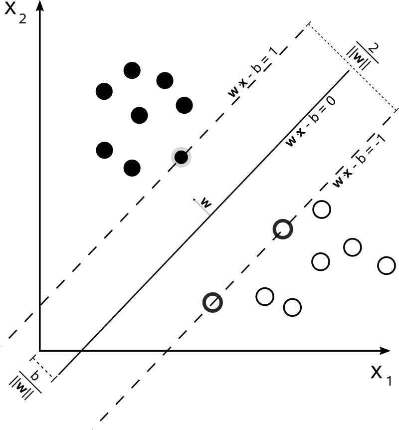

## Wprowadzenie

*Support Vector Machines* (SVM) to rodzina metod uczenia nadzorowanego opartych na geometrii przestrzeni cech i optymalizacji wypukłej. Historycznie SVM wyrosły z prac nad maksymalnym marginesem w klasyfikacji liniowej na początku lat 90. (m.in. idea *maximum margin classifier*), a następnie zostały uogólnione przez „trik jądrowy” (*kernel trick*) na sytuacje nieliniowo separowalne. Z perspektywy klasyfikacji SVM należą do metod **dyskryminacyjnych**: nie modelują rozkładów $\mathbb{P}(x\mid y)$, lecz konstruują granicę decyzyjną w przestrzeni cech tak, aby jak najlepiej rozdzielała klasy przy kontrolowanej złożoności.

W praktyce SVM spotykamy w dwóch podstawowych wariantach: (i) klasyfikacja SVC, gdzie uczymy hiperpłaszczyznę maksymalizującą margines, oraz (ii) regresja SVR, gdzie uczymy funkcję o maksymalnej „płaskości” w sensie normy $\|w\|$ przy tolerancji błędu typu $\varepsilon$-insensitive. W obu przypadkach kluczowe pojęcia to: hiperpłaszczyzna, margines, wektory nośne oraz jądra.

## Klasyfikacja liniowo separowalna: twardy margines

Rozważamy dane uczące $\{(x_i,y_i)\}_{i=1}^n$, gdzie $x_i\in\mathbb{R}^p$ i $y_i\in\{-1,+1\}$. Hiperpłaszczyzna ma postać $w^\top x + b = 0$. SVM wybiera taką hiperpłaszczyznę, która maksymalizuje margines, tj. minimalizuje $\|w\|$ przy warunkach poprawnej klasyfikacji z zapasem:

$$
\min_{w,b}\ \frac{1}{2}\|w\|^2\quad\text{s.t.}\quad y_i(w^\top x_i + b)\ge 1,\ i=1,\dots,n.
$$

Warunki $y_i(w^\top x_i + b)\ge 1$ oznaczają, że obserwacje leżą po właściwej stronie dwóch hiperpłaszczyzn $w^\top x + b = \pm 1$, które wyznaczają pas marginesu. SVM nie szuka więc dowolnej hiperpłaszczyzny poprawnie rozdzielającej klasy, ponieważ takich rozwiązań może być wiele. Wybiera tę, która ma największy zapas bezpieczeństwa względem najbliższych obserwacji. Szerokość marginesu wynosi $2/\|w\|$, więc minimalizacja $\|w\|$ jest równoważna maksymalizacji marginesu. Dzięki temu granica decyzyjna jest mniej wrażliwa na niewielkie zaburzenia danych i zwykle lepiej generalizuje na nowe obserwacje. Obserwacje, które leżą dokładnie na brzegach marginesu, nazywamy **wektorami nośnymi** (*support vectors*) – to one determinują położenie rozwiązania, podczas gdy punkty położone dalej od granicy mają mniejszy wpływ na optymalną hiperpłaszczyznę.

{fig-align="center" width=30%}

## Miękki margines: dopuszczenie naruszeń i rola parametru $C$

W danych rzeczywistych idealna separacja jest rzadkością. Wprowadzamy więc zmienne luzu $\xi_i\ge 0$, które pozwalają naruszać margines i (w skrajnym przypadku) popełniać błędy klasyfikacji:

$$
\min_{w,b,\xi}\ \frac{1}{2}\|w\|^2 + C\sum_{i=1}^n\xi_i\quad\text{s.t.}\quad y_i(w^\top x_i + b)\ge 1-\xi_i,\ \xi_i\ge 0.
$$


Zmienna luzu $\xi_i$ jest definiowana oddzielnie dla każdej obserwacji $x_i$. Można ją interpretować jako wielkość naruszenia warunku marginesu przez tę konkretną obserwację. Jeżeli punkt spełnia warunek twardego marginesu, czyli $y_i(w^\top x_i+b)\ge 1$, wtedy $\xi_i=0$. Jeżeli warunek nie jest spełniony, zmienna $\xi_i$ przyjmuje najmniejszą wartość potrzebną do tego, aby nierówność $y_i(w^\top x_i+b)\ge 1-\xi_i$ była prawdziwa. Równoważnie można zapisać:

$$
\xi_i=\max\{0,\ 1-y_i(w^\top x_i+b)\}.
$$

Interpretacja wartości $\xi_i$ zależy od położenia punktu względem granicy decyzyjnej i marginesu, a jednocześnie pozwala określić, które obserwacje są wektorami nośnymi. Gdy $\xi_i=0$ i jednocześnie $y_i(w^\top x_i+b)>1$, obserwacja leży poprawnie poza marginesem i nie jest wektorem nośnym. Gdy $\xi_i=0$ oraz $y_i(w^\top x_i+b)=1$, obserwacja leży dokładnie na brzegu marginesu i jest wektorem nośnym. Gdy $0<\xi_i<1$, obserwacja nadal jest poprawnie sklasyfikowana, ale znajduje się wewnątrz marginesu, czyli zbyt blisko granicy decyzyjnej; taka obserwacja również jest wektorem nośnym. Gdy $\xi_i=1$, obserwacja leży dokładnie na granicy decyzyjnej $w^\top x+b=0$. Natomiast gdy $\xi_i>1$, obserwacja znajduje się po złej stronie granicy decyzyjnej i jest błędnie sklasyfikowana. W przypadkach $\xi_i\ge 1$ obserwacja także jest wektorem nośnym, ponieważ narusza warunek marginesu i wpływa na rozwiązanie optymalizacyjne.

W ten sposób soft-margin SVM nie wymaga, aby wszystkie punkty spełniały idealny warunek marginesu. Zamiast tego dopuszcza naruszenia, ale dolicza je do funkcji celu przez składnik $C\sum_i \xi_i$. Im większe są wartości $\xi_i$, tym większa kara za obserwacje trudne, leżące wewnątrz marginesu lub błędnie sklasyfikowane. Parametr $C>0$ reguluje kompromis między szerokością marginesu a karą za naruszenia: duże $C$ prowadzi do silniejszego „ścigania” błędów treningowych, a małe $C$ do większej regularizacji i szerszego marginesu kosztem większej tolerancji błędów.

```{python}
#| code-fold: true
import numpy as np
import matplotlib.pyplot as plt
from sklearn.svm import SVC

# Generujemy dane z częściowym zachodzeniem klas
np.random.seed(42)
X1 = np.random.randn(40, 2) + np.array([2, 2])
X2 = np.random.randn(40, 2) + np.array([0, 0])

# Dodajemy kilka punktów "trudnych" w obszarze zachodzenia
X1 = np.vstack([X1, np.array([[0.5, 0.5], [0.3, 0.8]])])
X2 = np.vstack([X2, np.array([[1.8, 1.5], [1.5, 2.0]])])

X = np.vstack([X1, X2])
y = np.hstack([np.ones(len(X1)), -np.ones(len(X2))])

# Funkcja rysująca granicę decyzyjną i margines
def plot_svm_decision_boundary(ax, clf, X, y, title):
    # Siatka
    x_min, x_max = X[:, 0].min() - 1, X[:, 0].max() + 1
    y_min, y_max = X[:, 1].min() - 1, X[:, 1].max() + 1
    xx, yy = np.meshgrid(np.linspace(x_min, x_max, 200),
                         np.linspace(y_min, y_max, 200))
    
    # Funkcja decyzyjna
    Z = clf.decision_function(np.c_[xx.ravel(), yy.ravel()])
    Z = Z.reshape(xx.shape)
    
    # Granica decyzyjna i margines
    ax.contour(xx, yy, Z, levels=[-1, 0, 1], linewidths=[1.5, 2.5, 1.5],
               linestyles=['dashed', 'solid', 'dashed'], colors=['gray', 'black', 'gray'])
    
    # Punkty
    ax.scatter(X[y == 1, 0], X[y == 1, 1], c='royalblue', s=50, 
               edgecolors='k', alpha=0.7, label='Klasa +1')
    ax.scatter(X[y == -1, 0], X[y == -1, 1], c='coral', s=50, 
               edgecolors='k', alpha=0.7, label='Klasa -1')
    
    # Wektory nośne
    ax.scatter(clf.support_vectors_[:, 0], clf.support_vectors_[:, 1],
               s=200, linewidth=2, facecolors='none', edgecolors='green',
               label=f'Wektory nośne ({len(clf.support_vectors_)})')
    
    ax.set_xlim(x_min, x_max)
    ax.set_ylim(y_min, y_max)
    ax.set_xlabel('$x_1$')
    ax.set_ylabel('$x_2$')
    ax.set_title(title)
    ax.legend(loc='upper left', fontsize=8)
    ax.grid(alpha=0.3)

# Trenujemy SVM z różnymi wartościami C
fig, axes = plt.subplots(1, 3, figsize=(14, 4))

C_values = [0.1, 1, 100]
for ax, C in zip(axes, C_values):
    clf = SVC(kernel='linear', C=C)
    clf.fit(X, y)
    plot_svm_decision_boundary(ax, clf, X, y, f'C = {C}')

plt.tight_layout()
plt.show()
```

Przy małym $C=0.1$ margines jest szerszy (większa odległość między przerywaną linią a linią ciągłą), ale model toleruje więcej naruszeń – wiele punktów znajduje się wewnątrz marginesu lub po złej stronie. Przy dużym $C=100$ margines jest węższy, a granica decyzyjna stara się uniknąć błędów kosztem mniejszej regularyzacji, co może prowadzić do przeuczenia.

## Nieliniowa separacja i jądra

Dotychczas rozważaliśmy sytuację, w której granica decyzyjna była hiperpłaszczyzną w oryginalnej przestrzeni cech. Oznacza to, że dla dwóch cech $x=(x_1,x_2)$ klasyfikator liniowy może wyznaczyć jedynie prostą postaci $w_1x_1+w_2x_2+b=0$. W wielu problemach taki opis jest zbyt prosty: klasy mogą być rozdzielone okręgiem, elipsą, parabolą lub bardziej złożoną krzywą. Idea metod kernelowych polega na tym, aby zamiast szukać liniowej granicy w oryginalnych cechach, przenieść dane do bogatszej przestrzeni cech, w której separacja może stać się liniowa.

Przykładowo, jeżeli klasy są rozdzielone w przybliżeniu przez zależność $x_1^2+x_2^2=1$, to w przestrzeni $(x_1,x_2)$ granica ma kształt okręgu, a więc nie jest liniowa. Można jednak utworzyć dodatkową cechę $x_1^2+x_2^2$ i rozważać odwzorowanie

$$
\varphi(x)=(x_1,x_2,x_1^2+x_2^2).
$$

W tej nowej przestrzeni punkty blisko środka układu współrzędnych mają małą trzecią współrzędną, a punkty odległe od środka mają dużą trzecią współrzędną. Granica $x_1^2+x_2^2-1=0$ może być wtedy traktowana jako liniowa względem nowych cech. Otrzymujemy więc nieliniową granicę w oryginalnej przestrzeni, ale liniową granicę w przestrzeni przekształconej.

W tym miejscu pojawia się pojęcie jądra. Jądro jest funkcją dwóch obserwacji, która mierzy ich podobieństwo tak, jakby najpierw zostały przeniesione do bogatszej przestrzeni cech. Formalnie zapisujemy

$$
f(x)=w^\top \varphi(x)+b.
$$

Powyższy zapis pokazuje ideę liniowego klasyfikatora w przekształconej przestrzeni cech, ale nie wyjaśnia jeszcze, jak uniknąć jawnego konstruowania $\varphi(x)$. Do tego służy funkcja jądra

$$
K(x,z)=\langle\varphi(x),\varphi(z)\rangle,
$$

gdzie $\varphi$ oznacza odwzorowanie do nowej przestrzeni cech, a $\langle\cdot,\cdot\rangle$ jest iloczynem skalarnym w tej przestrzeni. Oznacza to, że $K(x,z)$ nie musi być zwykłym iloczynem skalarnym $x^\top z$ w oryginalnych cechach. Może odpowiadać iloczynowi skalarnemu po nieliniowej transformacji danych.

Dobrze widać to na przykładzie jądra wielomianowego stopnia drugiego. Dla dwóch obserwacji dwuwymiarowych $x=(x_1,x_2)$ oraz $z=(z_1,z_2)$ rozważmy funkcję

$$
K(x,z)=(x^\top z)^2.
$$

Ponieważ $x^\top z=x_1z_1+x_2z_2$, po podniesieniu do kwadratu otrzymujemy

$$
K(x,z)=(x_1z_1+x_2z_2)^2
=x_1^2z_1^2+2x_1x_2z_1z_2+x_2^2z_2^2.
$$

Ten sam wynik można zapisać jako iloczyn skalarny dwóch wektorów po nieliniowej transformacji. Wystarczy zdefiniować

$$
\varphi(x)=(x_1^2,\sqrt{2}x_1x_2,x_2^2),
\qquad
\varphi(z)=(z_1^2,\sqrt{2}z_1z_2,z_2^2).
$$

Wtedy

$$
\langle\varphi(x),\varphi(z)\rangle
=x_1^2z_1^2+2x_1x_2z_1z_2+x_2^2z_2^2
=K(x,z).
$$

Oznacza to, że jądro $K(x,z)=(x^\top z)^2$ działa tak, jakbyśmy najpierw zastąpili oryginalne cechy $(x_1,x_2)$ nowymi cechami kwadratowymi $(x_1^2,\sqrt{2}x_1x_2,x_2^2)$, a dopiero potem policzyli zwykły iloczyn skalarny. Właśnie na tym polega intuicja triku jądrowego: obliczamy podobieństwo w bogatszej, nieliniowej przestrzeni cech, nie konstruując tej przestrzeni jawnie dla całego zbioru danych.

### Popularne jądra i ich zastosowania

Najprostszym przypadkiem jest jądro liniowe $K(x,z)=x^\top z$. Jest ono równoważne klasycznemu liniowemu SVM, ponieważ nie wprowadza nieliniowego odwzorowania przestrzeni cech. Stosuje się je przede wszystkim wtedy, gdy dane są liniowo lub prawie liniowo separowalne, a także w problemach wysokowymiarowych i rzadkich, takich jak klasyfikacja tekstów, dane genomowe lub reprezentacje typu *bag-of-words*. Jądro liniowe jest szybkie, skalowalne i relatywnie łatwe do interpretacji, ale ma ograniczoną elastyczność, ponieważ nie pozwala modelować złożonych nieliniowych granic decyzyjnych.

Jądro wielomianowe ma postać $K(x,z)=(\gamma x^\top z+r)^d$, gdzie $d$ oznacza stopień wielomianu, $\gamma$ odpowiada za skalowanie iloczynu skalarnego, a $r$ jest stałą przesunięcia. Takie jądro pozwala uwzględniać interakcje między cechami oraz zależności wielomianowe do stopnia $d$. Jest użyteczne wtedy, gdy z wiedzy dziedzinowej wynika, że znaczenie mają kombinacje cech, na przykład interakcje między pikselami w obrazach lub zależności kwadratowe i sześcienne w danych niskowymiarowych. W praktyce wymaga ostrożnego doboru parametrów, ponieważ duży stopień $d$ albo zbyt duża wartość $\gamma$ mogą prowadzić do nadmiernie złożonej granicy decyzyjnej i przeuczenia.

Jądro radialne Gaussa, nazywane najczęściej jądrem RBF (*radial basis function*), ma postać $K(x,z)=\exp(-\gamma\|x-z\|^2)$. Wartość jądra jest duża, gdy punkty $x$ i $z$ leżą blisko siebie, oraz szybko maleje wraz ze wzrostem odległości między nimi. Parametr $\gamma>0$ kontroluje lokalność podobieństwa: małe wartości dają gładsze, bardziej globalne granice decyzyjne, natomiast duże wartości prowadzą do granic bardziej lokalnych i silniej dopasowanych do danych treningowych. Jądro RBF jest często traktowane jako domyślny wybór dla danych nisko- i średniowymiarowych, gdy spodziewamy się nieliniowych zależności, ale nie znamy ich konkretnej postaci. Wymaga jednak standaryzacji cech oraz strojenia parametrów $C$ i $\gamma$.

Jądro sigmoidalne $K(x,z)=\tanh(\gamma x^\top z+r)$ jest inspirowane funkcją aktywacji stosowaną w sieciach neuronowych. Historycznie bywało interpretowane jako powiązanie SVM z płytkimi sieciami neuronowymi, ale obecnie jest używane stosunkowo rzadko. Jego praktycznym ograniczeniem jest to, że dla niektórych wartości parametrów nie spełnia warunków poprawnego jądra dodatnio określonego, co może prowadzić do niestabilności optymalizacji.

Jądro Laplace'a ma postać $K(x,z)=\exp(-\gamma\|x-z\|_1)$ i jest podobne do jądra RBF, ale zamiast normy euklidesowej wykorzystuje normę $L^1$. Może być użyteczne wtedy, gdy chcemy mierzyć podobieństwo w sposób bardziej odporny na pojedyncze duże odchylenia w cechach. W praktyce stosuje się je rzadziej niż klasyczne jądro RBF, ale może być sensowną alternatywą w danych, w których odległość Manhattan lepiej opisuje strukturę podobieństwa między obserwacjami.

## Estymacja parametrów w SVM: margines twardy i miękki

Estymacja parametrów SVM jest problemem optymalizacji wypukłej. W wersji liniowej parametry modelu to $(w,b)$, natomiast w ujęciu dualnym (które jest kluczowe zarówno obliczeniowo, jak i dla jąder) parametrami roboczymi stają się mnożniki Lagrange’a $\alpha_1,\dots,\alpha_n$ oraz $b$. Przejście do postaci dualnej nie jest tylko „trikiem” formalnym: ono wyjaśnia, dlaczego rozwiązanie zależy wyłącznie od części obserwacji (wektorów nośnych) oraz dlaczego kernel SVM można zrealizować bez jawnego konstruowania $\varphi(x)$.

### Margines twardy: od postaci pierwotnej do dualnej

W hard-margin SVM rozwiązujemy zadanie z ograniczeniami nierównościowymi. Aby przejść do dualu, konstruujemy Lagrangian przez dołączenie ograniczeń z mnożnikami $\alpha_i\ge 0$. Otrzymujemy funkcję:

$$
\mathcal{L}(w,b,\alpha)=\frac{1}{2}\|w\|^2-\sum_{i=1}^n \alpha_i\big(y_i(w^\top x_i+b)-1\big).
$$

Następnie narzucamy warunki stacjonarności (pochodne po $w$ i $b$ równe zero), które są kluczowe, bo pozwalają wyeliminować $w$ i $b$ z problemu. Z pochodnej po w dostajemy:

$$
\frac{\partial \mathcal{L}}{\partial w}=0 \quad\Rightarrow\quad
w=\sum_{i=1}^n \alpha_i y_i x_i,
$$

a z pochodnej po $b$:

$$
\frac{\partial \mathcal{L}}{\partial b}=0 \quad\Rightarrow\quad
\sum_{i=1}^n \alpha_i y_i=0.
$$

Teraz podstawiamy warunki stacjonarności do Lagrangianu, aby otrzymać funkcję zależną wyłącznie od $\alpha$. Przypomnijmy, że

$$
\mathcal{L}(w,b,\alpha)=
\frac{1}{2}\|w\|^2
-
\sum_{i=1}^n \alpha_i\big(y_i(w^\top x_i+b)-1\big).
$$

Najpierw rozwijamy nawias:

$$
\mathcal{L}(w,b,\alpha)=
\frac{1}{2}\|w\|^2
-
\sum_{i=1}^n \alpha_i y_i w^\top x_i
-
b\sum_{i=1}^n \alpha_i y_i
+
\sum_{i=1}^n \alpha_i.
$$

Z warunku stacjonarności względem $b$ mamy

$$
\sum_{i=1}^n \alpha_i y_i=0,
$$

więc składnik zawierający $b$ znika. Dostajemy

$$
\mathcal{L}(w,\alpha)=
\frac{1}{2}\|w\|^2
-
\sum_{i=1}^n \alpha_i y_i w^\top x_i
+
\sum_{i=1}^n \alpha_i.
$$

Następnie korzystamy z warunku stacjonarności względem $w$:

$$
w=\sum_{j=1}^n \alpha_j y_j x_j.
$$

Pierwszy składnik Lagrangianu zapisujemy jako

$$
\frac{1}{2}\|w\|^2
=
\frac{1}{2}w^\top w.
$$

Po podstawieniu wzoru na $w$:

$$
\frac{1}{2}w^\top w
=
\frac{1}{2}
\left(\sum_{i=1}^n \alpha_i y_i x_i\right)^\top
\left(\sum_{j=1}^n \alpha_j y_j x_j\right).
$$

Ponieważ iloczyn skalarny rozdziela się względem sum, otrzymujemy

$$
\frac{1}{2}\|w\|^2
=
\frac{1}{2}
\sum_{i=1}^n\sum_{j=1}^n
\alpha_i\alpha_j y_i y_j x_i^\top x_j.
$$

Teraz rozpisujemy drugi składnik:

$$
\sum_{i=1}^n \alpha_i y_i w^\top x_i.
$$

Po podstawieniu

$$
w=\sum_{j=1}^n \alpha_j y_j x_j
$$

mamy

$$
\sum_{i=1}^n \alpha_i y_i w^\top x_i
=
\sum_{i=1}^n \alpha_i y_i
\left(
\sum_{j=1}^n \alpha_j y_j x_j
\right)^\top x_i.
$$

Stąd

$$
\sum_{i=1}^n \alpha_i y_i w^\top x_i
=
\sum_{i=1}^n\sum_{j=1}^n
\alpha_i\alpha_j y_i y_j x_j^\top x_i.
$$

Ponieważ $x_j^\top x_i=x_i^\top x_j$, możemy zapisać

$$
\sum_{i=1}^n \alpha_i y_i w^\top x_i
=
\sum_{i=1}^n\sum_{j=1}^n
\alpha_i\alpha_j y_i y_j x_i^\top x_j.
$$

Podstawiamy oba wyrażenia do Lagrangianu:

$$
\mathcal{L}(\alpha)=
\frac{1}{2}
\sum_{i=1}^n\sum_{j=1}^n
\alpha_i\alpha_j y_i y_j x_i^\top x_j
-
\sum_{i=1}^n\sum_{j=1}^n
\alpha_i\alpha_j y_i y_j x_i^\top x_j
+
\sum_{i=1}^n \alpha_i.
$$

Pierwsze dwa składniki są podobne i redukują się do

$$
\frac{1}{2}A-A=-\frac{1}{2}A,
$$

gdzie

$$
A=
\sum_{i=1}^n\sum_{j=1}^n
\alpha_i\alpha_j y_i y_j x_i^\top x_j.
$$

Ostatecznie otrzymujemy funkcję dualną

$$
\mathcal{L}(\alpha)=
\sum_{i=1}^n \alpha_i
-
\frac{1}{2}
\sum_{i=1}^n\sum_{j=1}^n
\alpha_i\alpha_j y_i y_j x_i^\top x_j.
$$

Ponieważ w problemie dualnym maksymalizujemy tę funkcję względem $\alpha$, więc mamy postać

$$
\max_{\alpha}\ 
\sum_{i=1}^n \alpha_i
-
\frac{1}{2}
\sum_{i=1}^n\sum_{j=1}^n
\alpha_i\alpha_j y_i y_j\, x_i^\top x_j,
\quad
\text{s.t. } \alpha_i\ge 0,\ \sum_{i=1}^n \alpha_i y_i=0.
$$

Otrzymane zadanie jest problemem programowania kwadratowego (QP) z liniowymi ograniczeniami. Ma ono tę samą treść optymalizacyjną co problem pierwotny, ale jest zapisane w innych zmiennych: zamiast bezpośrednio szukać $w$ i $b$, wyznaczamy współczynniki $\alpha_i$ przypisane do kolejnych obserwacji treningowych. Następnie, po rozwiązaniu problemu dualnego, wektor normalny do hiperpłaszczyzny można odtworzyć ze wzoru

$$
\hat w=\sum_{i=1}^n \alpha_i y_i x_i.
$$

W tym miejscu potrzebna jest jeszcze interpretacja współczynników $\alpha_i$. Sam problem dualny mówi, że każda obserwacja ma swój mnożnik Lagrange'a, ale nie wyjaśnia jeszcze, które obserwacje rzeczywiście wpływają na granicę decyzyjną. Do tego służą warunki KKT (Karush–Kuhn–Tucker), czyli warunki optymalności dla problemów z ograniczeniami. W przypadku hard-margin SVM najważniejszy jest warunek komplementarności

$$
\alpha_i\left[y_i(w^\top x_i+b)-1\right]=0.
$$

Warunek ten łączy dwa elementy: mnożnik $\alpha_i$ oraz ograniczenie marginesowe odpowiadające obserwacji $x_i$. Jego sens jest następujący: dla każdej obserwacji iloczyn tych dwóch składników musi być równy zero, więc albo ograniczenie jest nieaktywne, albo odpowiadający mu mnożnik może być dodatni.

Jeżeli obserwacja leży poprawnie poza marginesem, to zachodzi

$$
y_i(w^\top x_i+b)>1.
$$

Wtedy składnik $y_i(w^\top x_i+b)-1$ jest dodatni. Aby warunek komplementarności był spełniony, musi być $\alpha_i=0$. Taka obserwacja nie wpływa na położenie hiperpłaszczyzny, ponieważ jej ograniczenie nie jest aktywne: punkt znajduje się dalej od granicy niż wymaga tego margines.

Jeżeli natomiast $\alpha_i>0$, to z warunku komplementarności musi wynikać

$$
y_i(w^\top x_i+b)-1=0,
$$

czyli

$$
y_i(w^\top x_i+b)=1.
$$

Oznacza to, że obserwacja leży dokładnie na brzegu marginesu. Takie obserwacje są wektorami nośnymi. To one wyznaczają położenie optymalnej hiperpłaszczyzny, ponieważ tylko dla nich współczynniki $\alpha_i$ mogą być dodatnie. Warunek KKT pozwala więc przejść od czysto algebraicznego rozwiązania dualnego do geometrycznej interpretacji: punkty z $\alpha_i=0$ są nieaktywne, natomiast punkty z $\alpha_i>0$ leżą na brzegu marginesu i „podpierają” rozwiązanie.

Po wyznaczeniu współczynników $\alpha_i$ można odtworzyć pełną funkcję decyzyjną. Wektor $\hat w$ wyznaczamy z podanego wcześniej wzoru, natomiast wyraz wolny $\hat b$ obliczamy z dowolnego wektora nośnego $x_s$. Dla takiego punktu zachodzi warunek brzegowy

$$
y_s(\hat w^\top x_s+\hat b)=1.
$$

Ponieważ $y_s\in\{-1,+1\}$, równoważnie otrzymujemy

$$
\hat w^\top x_s+\hat b=y_s,
$$

a więc

$$
\hat b=y_s-\hat w^\top x_s.
$$

W praktyce $\hat b$ często oblicza się dla kilku wektorów nośnych i uśrednia, aby zmniejszyć wpływ błędów numerycznych.

### Margines miękki

W soft-margin SVM punktem wyjścia jest postać pierwotna z dodatkowymi zmiennymi luzu $\xi_i\ge 0$:

$$
\min_{w,b,\xi}\ \frac{1}{2}\|w\|^2+C\sum_{i=1}^n \xi_i
\quad\text{s.t.}\quad
y_i(w^\top x_i+b)\ge 1-\xi_i,\quad \xi_i\ge 0.
$$

W porównaniu z hard-margin SVM zmienia się interpretacja ograniczeń: obserwacja nie musi leżeć poza marginesem, ale każde naruszenie jest mierzone przez $\xi_i$ i karane w funkcji celu przez składnik $C\xi_i$. Parametr $C>0$ określa, jak kosztowne są naruszenia marginesu i błędy klasyfikacji.

Przejście do postaci dualnej przebiega podobnie jak wcześniej, ale pojawiają się dwa rodzaje ograniczeń: ograniczenia marginesowe oraz warunki nieujemności $\xi_i\ge 0$. Dlatego w Lagrangianie występują dwa zestawy mnożników: $\alpha_i\ge 0$ dla ograniczeń marginesowych oraz $\mu_i\ge 0$ dla ograniczeń $\xi_i\ge 0$. Warunek stacjonarności względem $\xi_i$ prowadzi do zależności

$$
C-\alpha_i-\mu_i=0.
$$

Ponieważ $\mu_i\ge 0$, otrzymujemy

$$
\alpha_i\le C.
$$

Jednocześnie, tak jak wcześniej, mnożniki Lagrange'a spełniają $\alpha_i\ge 0$. Stąd w soft-margin SVM pojawia się ograniczenie

$$
0\le \alpha_i\le C.
$$

Funkcja celu w problemie dualnym ma tę samą postać jak w przypadku hard-margin SVM, ponieważ dane nadal występują przez iloczyny skalarne $x_i^\top x_j$. Zmienia się natomiast zakres dopuszczalnych wartości mnożników $\alpha_i$:

$$
\max_{\alpha}\ \sum_{i=1}^n \alpha_i-\frac{1}{2}\sum_{i=1}^n\sum_{j=1}^n \alpha_i\alpha_j y_i y_j\, x_i^\top x_j,
\quad
\text{s.t. } 0\le \alpha_i\le C,\ \sum_{i=1}^n \alpha_i y_i=0.
$$

Ograniczenie górne $\alpha_i\le C$ ma ważną interpretację. W hard-margin SVM mnożnik $\alpha_i$ mógł rosnąć bez takiego ograniczenia, ponieważ nie dopuszczaliśmy naruszeń marginesu. W soft-margin SVM pojedyncza obserwacja nie może wymusić dowolnie dużego wpływu na rozwiązanie dualne, ponieważ jej wpływ jest ograniczony przez parametr $C$. Im większe $C$, tym silniej model reaguje na punkty naruszające margines; im mniejsze $C$, tym łatwiej model „odpuszcza” trudne obserwacje na rzecz szerszego marginesu.

Warunki KKT pozwalają powiązać wartości $\alpha_i$ z położeniem obserwacji względem marginesu. Jeżeli $\alpha_i=0$, obserwacja jest nieaktywna: leży poprawnie poza marginesem i nie wpływa na położenie granicy decyzyjnej. Jeżeli $0<\alpha_i<C$, obserwacja leży dokładnie na brzegu marginesu, czyli spełnia

$$
y_i(w^\top x_i+b)=1.
$$

Są to klasyczne wektory nośne, szczególnie użyteczne do obliczania $\hat b$.

Jeżeli natomiast $\alpha_i=C$, obserwacja jest punktem nasyconym ograniczeniem dualnym. Taki przypadek zwykle oznacza, że punkt znajduje się wewnątrz marginesu albo po złej stronie granicy decyzyjnej, choć granicznie może także leżeć na brzegu marginesu. Dlatego nie należy utożsamiać warunku $\alpha_i=C$ wyłącznie z błędną klasyfikacją. Precyzyjniej: są to obserwacje, dla których kara za naruszenie osiąga maksymalny dopuszczalny wpływ w dualu. Do wyznaczania $\hat b$ najbezpieczniej używać punktów spełniających $0<\alpha_i<C$, ponieważ dla nich zachodzi dokładna równość brzegowa bez nasycenia karą.

Soft-margin SVM można też zapisać bez jawnych zmiennych luzu. Dla ustalonych $w$ i $b$ najmniejsza wartość $\xi_i$, która spełnia ograniczenie $y_i(w^\top x_i+b)\ge 1-\xi_i$, wynosi

$$
\xi_i=\max\{0,\ 1-y_i(w^\top x_i+b)\}.
$$

Po podstawieniu tego wyrażenia do funkcji celu otrzymujemy równoważny zapis

$$
\min_{w,b}\ \frac{1}{2}\|w\|^2 + C\sum_{i=1}^n \max\{0,\ 1-y_i(w^\top x_i+b)\}.
$$

Drugi składnik jest sumą strat zawiasowych (*hinge loss*). W tej postaci dobrze widać, że soft-margin SVM łączy dwa mechanizmy: regularizację przez minimalizację $\|w\|^2$ oraz karanie obserwacji, które znajdują się wewnątrz marginesu lub są błędnie sklasyfikowane. Parametr $C$ reguluje względną siłę tej kary względem szerokości marginesu.

### Kernelowa wersja a estymacja parametrów

Wersja kernelowa nie zmienia ogólnej logiki estymacji SVM: nadal rozwiązujemy problem dualny względem mnożników $\alpha_i$, a następnie wyznaczamy wyraz wolny $b$. Zmienia się natomiast sposób, w jaki dane wejściowe pojawiają się w zadaniu optymalizacyjnym. W liniowym SVM problem dualny zależy od iloczynów skalarnych $x_i^\top x_j$. W kernelowym SVM zastępujemy je wartościami jądra

$$
x_i^\top x_j \quad\longrightarrow\quad K(x_i,x_j)=\langle\varphi(x_i),\varphi(x_j)\rangle.
$$

Oznacza to, że algorytm pracuje tak, jakby dane zostały przeniesione do przestrzeni cech $\varphi(x)$, ale w samym zadaniu optymalizacyjnym występują tylko wartości funkcji jądra. W praktyce tworzy się macierz jądra, czyli macierz podobieństw między wszystkimi parami obserwacji treningowych:

$$
K_{ij}=K(x_i,x_j).
$$

Dla soft-margin SVM problem dualny w wersji kernelowej ma postać

$$
\max_{\alpha}\ \sum_{i=1}^n \alpha_i-\frac{1}{2}\sum_{i=1}^n\sum_{j=1}^n \alpha_i\alpha_j y_i y_j\, K(x_i,x_j),
\quad
\text{s.t. } 0\le \alpha_i\le C,\ \sum_{i=1}^n \alpha_i y_i=0.
$$

Warunki ograniczające $\alpha_i$ mają taką samą interpretację jak w liniowym soft-margin SVM. Punkty z $\alpha_i=0$ nie wpływają na funkcję decyzyjną, natomiast punkty z $\alpha_i>0$ są wektorami nośnymi. Po rozwiązaniu problemu dualnego funkcja decyzyjna ma postać

$$
f(x)=\sum_{i=1}^n \alpha_i y_i K(x_i,x)+b.
$$

Ponieważ dla większości obserwacji zwykle $\alpha_i=0$, suma efektywnie biegnie tylko po wektorach nośnych:

$$
f(x)=\sum_{i\in SV} \alpha_i y_i K(x_i,x)+b.
$$

W wersji liniowej można po rozwiązaniu dualu odtworzyć jawny wektor

$$
\hat w=\sum_i \alpha_i y_i x_i.
$$

W wersji kernelowej zwykle tego nie robimy, ponieważ odpowiadający mu wektor leży w przestrzeni cech $\mathcal{H}$ i miałby postać

$$
\hat w=\sum_i \alpha_i y_i\varphi(x_i).
$$

Jeżeli przestrzeń ta jest bardzo wysokowymiarowa albo nieskończenie wymiarowa, jawna rekonstrukcja $\hat w$ nie jest potrzebna. Model jest reprezentowany przez wektory nośne, ich współczynniki $\alpha_i$, etykiety $y_i$, funkcję jądra oraz wyraz wolny $b$.

Wyraz wolny $b$ wyznacza się z warunków KKT. Najwygodniej używać do tego wektorów nośnych spełniających $0<\alpha_i<C$, ponieważ dla takich punktów zachodzi równość brzegowa

$$
y_i f(x_i)=1.
$$

Po podstawieniu kernelowej funkcji decyzyjnej dostajemy

$$
b=y_i-\sum_{j\in SV}\alpha_j y_j K(x_j,x_i).
$$

W praktyce wartość $b$ często uśrednia się po wszystkich wektorach nośnych spełniających $0<\alpha_i<C$, aby zmniejszyć wpływ błędów numerycznych. Punkty z $\alpha_i=C$ są związane z nasyceniem ograniczenia dualnego i mogą naruszać margines, dlatego nie są najlepszym wyborem do stabilnego obliczania $b$.

## Wariant wieloklasowy

SVM jest z natury klasyfikatorem binarnym. Dla problemów wieloklasowych stosujemy konstrukcje redukcyjne. Najczęściej spotykamy:

- **one-vs-rest (OvR)** – uczymy $K$ klasyfikatorów binarnych „klasa $k$ vs reszta” i wybieramy klasę o największej wartości funkcji decyzyjnej;
- **one-vs-one (OvO)** – uczymy $K(K-1)/2$ klasyfikatorów dla każdej pary klas i stosujemy głosowanie.

W praktyce implementacje (np. scikit-learn) domyślnie stosują OvO dla `SVC`, a OvR jest często spotykany w wersjach liniowych (np. `LinearSVC`). Wybór strategii wpływa na koszt obliczeń i zachowanie w przypadku niezbalansowanych klas.

## SVM w regresji: SVR

W regresji nie rozdzielamy obserwacji na klasy, lecz szukamy funkcji przewidującej wartość liczbową $y$. W przypadku SVR (*Support Vector Regression*) funkcja regresji ma postać

$$
f(x)=w^\top\varphi(x)+b,
$$

gdzie $\varphi(x)$ oznacza ewentualne odwzorowanie do przestrzeni cech, tak jak w kernelowym SVM. Intuicja jest jednak inna niż w klasyfikacji. W SVC chcieliśmy znaleźć granicę decyzyjną z możliwie szerokim marginesem między klasami. W SVR chcemy znaleźć możliwie „płaską” funkcję regresji, czyli taką, dla której norma $\|w\|$ jest mała, ale jednocześnie dopuszczamy niewielkie błędy predykcji.

Kluczowym pojęciem jest strata $\varepsilon$-insensitive. Oznacza ona, że błędy mniejsze niż ustalony próg $\varepsilon$ nie są karane. Wokół funkcji $f(x)$ tworzymy więc pas tolerancji, często nazywany „rurką” $\varepsilon$. Dla obserwacji $x_i$ akceptujemy każdą predykcję, która spełnia warunek

$$
|y_i-f(x_i)|\le \varepsilon.
$$

Jeżeli punkt znajduje się wewnątrz tej rurki, jego błąd jest traktowany jako pomijalny. Model nie próbuje dopasować się idealnie do każdego punktu, lecz ignoruje odchylenia mniejsze niż $\varepsilon$. Dzięki temu SVR jest mniej wrażliwy na drobny szum pomiarowy niż zwykła regresja minimalizująca sumę kwadratów błędów.

Warunek $|y_i-f(x_i)|\le \varepsilon$ można zapisać jako dwa ograniczenia. Predykcja nie powinna być zbyt mała względem wartości obserwowanej:

$$
y_i-f(x_i)\le \varepsilon,
$$

ani zbyt duża względem wartości obserwowanej:

$$
f(x_i)-y_i\le \varepsilon.
$$

W danych rzeczywistych nie zawsze da się znaleźć funkcję, dla której wszystkie punkty leżą w rurce $\varepsilon$. Dlatego, podobnie jak w soft-margin SVM, wprowadza się zmienne luzu. W SVR potrzebne są dwa rodzaje zmiennych: $\xi_i$ oraz $\xi_i^*$. Pierwsza zmienna, $\xi_i$, mierzy przekroczenie rurki wtedy, gdy predykcja jest zbyt mała, czyli gdy $f(x_i)<y_i-\varepsilon$. Druga zmienna, $\xi_i^*$, mierzy przekroczenie rurki wtedy, gdy predykcja jest zbyt duża, czyli gdy $f(x_i)>y_i+\varepsilon$.

Problem optymalizacyjny SVR ma postać

$$
\min_{w,b,\xi,\xi^*}\ \frac{1}{2}\|w\|^2 + C\sum_{i=1}^n (\xi_i+\xi_i^*)
$$

przy ograniczeniach

$$
y_i - (w^\top\varphi(x_i)+b)\le \varepsilon + \xi_i,
$$

$$
(w^\top\varphi(x_i)+b) - y_i\le \varepsilon + \xi_i^*,
$$

$$
\xi_i\ge 0,\qquad \xi_i^*\ge 0.
$$

Pierwszy składnik funkcji celu, $\frac{1}{2}\|w\|^2$, odpowiada za płaskość funkcji regresji. Im mniejsza norma $\|w\|$, tym mniej zmienna i bardziej regularna jest funkcja. Drugi składnik, $C\sum_i(\xi_i+\xi_i^*)$, karze tylko te obserwacje, które wychodzą poza rurkę tolerancji. Parametr $C>0$ określa siłę tej kary. Duże $C$ oznacza, że model silnie karze przekroczenia rurki i próbuje dokładniej dopasować się do danych. Małe $C$ oznacza większą tolerancję dla odchyleń i zwykle bardziej wygładzoną funkcję regresji.

Równoważnie stratę dla pojedynczej obserwacji można zapisać jako

$$
L_\varepsilon(y_i,f(x_i))=\max\{0,\ |y_i-f(x_i)|-\varepsilon\}.
$$

Jeżeli błąd bezwzględny $|y_i-f(x_i)|$ jest mniejszy lub równy $\varepsilon$, strata wynosi zero. Jeżeli błąd przekracza $\varepsilon$, karana jest tylko nadwyżka ponad szerokość rurki.

Przykład liczbowy pokazuje tę zasadę najprościej. Załóżmy, że dla pewnej obserwacji rzeczywista wartość wynosi

$$
y_i=10,
$$

a przyjęta szerokość tolerancji to

$$
\varepsilon=2.
$$

Wtedy wszystkie predykcje z przedziału

$$
[y_i-\varepsilon,\ y_i+\varepsilon]=[8,12]
$$

nie są karane. Jeżeli model przewidzi $f(x_i)=11$, to błąd bezwzględny wynosi

$$
|10-11|=1\le 2,
$$

więc strata $\varepsilon$-insensitive wynosi zero. Punkt leży wewnątrz rurki.

Jeżeli model przewiduje $f(x_i)=14$, to błąd bezwzględny wynosi

$$
|10-14|=4.
$$

Ponieważ dopuszczamy błąd równy $2$, karana jest tylko nadwyżka

$$
4-2=2.
$$

W tym przypadku aktywna jest zmienna $\xi_i^*$, ponieważ predykcja jest zbyt duża. Mamy

$$
\xi_i^*=f(x_i)-y_i-\varepsilon=14-10-2=2,
\qquad
\xi_i=0.
$$

Jeżeli natomiast model przewiduje $f(x_i)=6$, to błąd bezwzględny również wynosi

$$
|10-6|=4,
$$

a strata ponownie wynosi $2$. Tym razem aktywna jest zmienna $\xi_i$, ponieważ predykcja jest zbyt mała:

$$
\xi_i=y_i-f(x_i)-\varepsilon=10-6-2=2,
\qquad
\xi_i^*=0.
$$

Ten przykład pokazuje, że SVR nie karze samego faktu popełnienia błędu, lecz dopiero przekroczenie ustalonej tolerancji $\varepsilon$. Punkty leżące wewnątrz rurki nie wpływają bezpośrednio na karę w funkcji celu. Punkty leżące na brzegu rurki lub poza nią są odpowiednikami wektorów nośnych w regresji, ponieważ to one wyznaczają położenie funkcji regresji. Podobnie jak SVC, SVR może korzystać z jąder: wówczas funkcja regresji jest liniowa w przestrzeni cech $\varphi(x)$, ale może być nieliniowa względem oryginalnych zmiennych.

## Założenia, zalety i wady

SVM zakłada, że klasy (lub zależność w regresji) są dobrze aproksymowalne przez hiperpłaszczyznę w pewnej przestrzeni cech (jawnej lub indukowanej jądrem). Metoda jest bardzo wrażliwa na skalę cech (zwłaszcza dla jąder RBF i wielomianowych), dlatego w praktyce niemal zawsze stosujemy standaryzację. SVM ma silne podstawy teoretyczne (maksymalizacja marginesu, optymalizacja wypukła), często dobrze działa w danych wysokowymiarowych (np. tekst) i przy umiarkowanych próbach. Wadą jest koszt obliczeniowy dla dużych $n$ (szczególnie w kernel SVM), konieczność strojenia hiperparametrów ($C$, $\gamma$, wybór jądra) oraz mniejsza interpretowalność w porównaniu z prostymi modelami liniowymi.

## Przykład klasyfikacji wieloklasowej

Poniżej wykorzystujemy zbiór `scikit-learn/iris` z Hugging Face i uczymy wieloklasowe SVM z jądrem RBF. Zwracamy uwagę na dwa elementy praktyczne: standaryzację oraz dobór hiperparametrów $C$ i $\gamma$ przez walidację krzyżową.

```{python}
import numpy as np
import pandas as pd

from datasets import load_dataset
from sklearn.model_selection import train_test_split, StratifiedKFold, GridSearchCV
from sklearn.pipeline import Pipeline
from sklearn.preprocessing import StandardScaler
from sklearn.svm import SVC
from sklearn.metrics import accuracy_score, classification_report, confusion_matrix, ConfusionMatrixDisplay
import matplotlib.pyplot as plt

# 1) Dane
iris = load_dataset("scikit-learn/iris", split="train")
df = iris.to_pandas()

# 2) Target i cechy
target_col = "Species"

# y: etykiety klas (kodujemy tekst do liczb)
y_raw = df[target_col]
if y_raw.dtype.kind in {"i", "u"}:
    y = y_raw.astype(int)
else:
    y = y_raw.astype("category").cat.codes

# X: wszystkie cechy liczbowe z wykluczeniem targetu
X = df.select_dtypes(include=["number"]).drop(columns=[target_col], errors="ignore")

X_train, X_test, y_train, y_test = train_test_split(
    X, y, test_size=0.25, random_state=42, stratify=y
)

# 3) Pipeline: skalowanie + SVC
pipe = Pipeline([
    ("scaler", StandardScaler()),
    ("svc", SVC(kernel="rbf"))
])

param_grid = {
    "svc__C": [0.1, 1, 10, 100],
    "svc__gamma": [0.01, 0.1, 1, 10]
}

cv = StratifiedKFold(n_splits=5, shuffle=True, random_state=42)
search = GridSearchCV(pipe, param_grid=param_grid, scoring="accuracy", cv=cv, n_jobs=-1)
search.fit(X_train, y_train)

best = search.best_estimator_
print("Best params:", search.best_params_)

y_pred = best.predict(X_test)
acc = accuracy_score(y_test, y_pred)
print("Test accuracy:", acc)
print(classification_report(y_test, y_pred))

cm = confusion_matrix(y_test, y_pred)
disp = ConfusionMatrixDisplay(cm)
plt.figure(figsize=(4.5,4))
disp.plot(values_format="d")
plt.title("SVM (RBF): macierz pomyłek (Iris)")
plt.tight_layout()
plt.show()
```

## Przykład regresyjny

W drugim przykładzie pokazujemy SVR na zbiorze `scikit-learn/Fish`. Ponownie stosujemy skalowanie i stroimy $C$, $\varepsilon$ oraz $\gamma$ (dla RBF) przez walidację krzyżową.

```{python}
import numpy as np
import pandas as pd

from datasets import load_dataset
from sklearn.model_selection import train_test_split, KFold, GridSearchCV
from sklearn.pipeline import Pipeline
from sklearn.preprocessing import StandardScaler
from sklearn.svm import SVR
from sklearn.metrics import r2_score, mean_squared_error

# 1) Dane: tabular regression (masa ryby) z Hugging Face
# Dataset: scikit-learn/Fish
fish = load_dataset("scikit-learn/Fish", split="train")
df = fish.to_pandas()

# 2) Target i cechy
# Target: 'Weight' (waga w gramach). Kolumna 'Species' jest kategoryczna;
# dla prostoty przykładu SVR używamy wyłącznie cech liczbowych.
target = "Weight"

y = df[target].astype(float)
X = df.select_dtypes(include=["number"]).drop(columns=[target], errors="ignore").copy()

X_train, X_test, y_train, y_test = train_test_split(
    X, y, test_size=0.25, random_state=42
)

pipe = Pipeline([
    ("scaler", StandardScaler()),
    ("svr", SVR(kernel="rbf"))
])

param_grid = {
    "svr__C": [1, 10, 100, 300],
    "svr__epsilon": [1, 5, 10, 20],
    "svr__gamma": [0.001, 0.01, 0.1, 1]
}

cv = KFold(n_splits=5, shuffle=True, random_state=42)
search = GridSearchCV(pipe, param_grid=param_grid, scoring="r2", cv=cv, n_jobs=-1)
search.fit(X_train, y_train)

best = search.best_estimator_
print("Best params:", search.best_params_)

pred = best.predict(X_test)
print("Test R2:", r2_score(y_test, pred))
print("Test RMSE:", np.sqrt(mean_squared_error(y_test, pred)))
```
